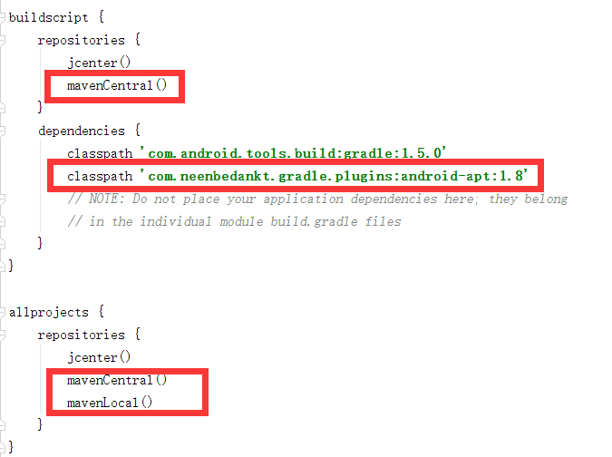
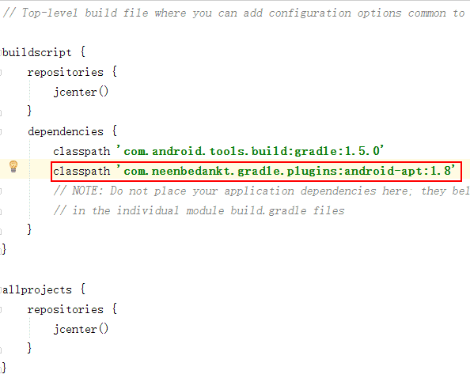

#开源框架合集
------------

### 1为什么要使用开源框架

1. 提高开发速度
2. 提高开发质量

### 2选择开源框架的原则

1. 聚合性框架一定要放弃.例如Afinal，xUtils
	* 大而全的框架容易导致牵一发而动全身.可读性差,耦合高,难扩展.

2. last commit超过一年以上或者issues一大堆没有fix的框架不要用.

3. 选择活跃度和人气高的项目

### 常见开源库

# 依赖注入
--------
### 1 依赖注入的概念

* 依赖(Dependency)

	* 如果在ClassA中用到了ClassB的实例,我们通常会直接new一个ClassB的对象,这种情况称为调用者ClassA对被调用者ClassB有一个依赖
	* 例如下面的代码中HRSystem就依赖与Person.
	* 示例代码中Person这种直接初始化的方式也叫Hard Init方式,弊端在于两个类之间不够独立,如果我们更改了Person的构造函数,所有使用到Person初始化方法的代码都要进行修改.

			public class HRSystem {
			
				public static void main(String[] args) {
					Person person = new Person();
			
				}
			}

* 依赖注入(DI:Dependency Injection):

	* 指程序运行过程中,调用者(HRSystem)需要被调用者(Person)的辅助,但是创建被调用者(Person)的工作不再由调用者(HRSystem)来完成,因此称为**控制反转(IOC:Inversion of Control)**,而是由相关的容器控制程序将被调用者(Person)的对象在外部创建出来并注入到调用者(HRSystem)的引用中

			public class HRSystem {

				@Inject
				Person person;

				public static void main(String[] args) {
				}
			}

* 为什么要使用依赖注入

	* 目的就是为了让调用者和被调用者之间解耦
	* 提高程序的扩展性，维护性
	* 可以注入依赖的模拟实现,使得测试变得更加简单.

* 原理图
	
### 2 Butterknife  

* 主页: https://github.com/JakeWharton/butterknife

* 用途: 主要用来简化各种初始化控件的操作

* 配置:
	1. 在app/build.gradle文件中dependencies节点添加如下代码
		* compile 'com.jakewharton:butterknife:7.0.1'
	2. 在Android Studio中点击 File-->Settings-->Plugins-->Browse repositories,搜索Android ButterKnife Zelezny插件,安装成功以后重启Android Studio.
	3. 在布局文件中添加控件的时候,所有需要在Activity/Fragment代码中进行控制的控件都要添加id属性
	4. 在Activity/Fragment 代码中,将鼠标放在布局文件的引用上(即R.layout.activity_main中的activity_main上面),此时按快捷键Alt + Insert或鼠标右键选择Generate
	5. 在弹出的菜单中选择Generate ButterKnife Injections,此时会再次弹出一个对话框
	6. 新的对话框中点击confirm后直接生成控件的引用,代替findViewById
	7. 如果需要处理控件的点击事件,可以选择对应控件的OnClick复选框.
	8. 如果是ListView的Item视图,还可以选择左下角的Create ViewHolder复选框,生成ViewHolder静态类.

* 技巧
	* 在AndroidStudio\plugins\android\lib\templates\gradle-projects\NewAndroidModule\recipe.xml.ftl中添加如下代码,以后新创建的工程默认会添加Butterknife依赖:

			<dependency mavenUrl="com.jakewharton:butterknife:7.0.1" />
* 代码示例

		@Bind(R.id.textView)
	    TextView tv;
	    
	    @OnClick(R.id.btn)
	    public void click(View view) {
	        tv.setText("我是依赖注解的");
	    }
	    @Override
	    protected void onCreate(Bundle savedInstanceState) {
	        super.onCreate(savedInstanceState);
	        setContentView(R.layout.activity_main);
	        ButterKnife.bind(this);
	    }

### 3 AndroidAnnotations 

* 主页: http://androidannotations.org/

* 用途: 
	1. 使用依赖注入Views,extras,System Service,resources
	2. 简化线程模型
	3. 事件绑定
	4. REST Client

* 配置:
	1. 在**project/build.gradle**文件中按下图所示添加代码:
	
				mavenCentral()

				classpath 'com.neenbedankt.gradle.plugins:android-apt:1.8'

				mavenCentral()
				mavenLocal()

		

	2. 在**app/build.gradle**文件中按下图所示添加代码:

				apply plugin: 'android-apt'
				apt {
				    arguments {
				        androidManifestFile variant.outputs[0]?.processResources?.manifestFile
				    }
				}

				apt "org.androidannotations:androidannotations:4.0.0"
				compile "org.androidannotations:androidannotations-api:4.0.0"

					

* 注意事项:

		* Manifest中注册的activity要在原类名后追加下划线”_”
		* 使用注解的控件和方法不能使用private修饰符	
		* 大型项目并不适用

* 代码示例

		@Fullscreen		//全屏
		@WindowFeature(Window.FEATURE_NO_TITLE) //Activity没有标题
		@EActivity(R.layout.my_activity) 		//布局文件在这里声明，不用在setContentView
		public class MyActivity extends Activity {
		
		    @ViewById //初始化控件，不需要自己实例化
		    EditText myEditText;
		
		    @ViewById(R.id.myTextView) //提供id来生成控件，如果不指定ID，默认以控件名进行查找，如上面的myEditText
		    TextView textView;
		
		    @StringRes(R.string.app_name)	//字符串资源
			String appName;

			@ColorRes(R.color.colorAccent)	//颜色资源
			int androidColor;
		
		    @BooleanRes
		    boolean someBoolean;
		
		    @SystemService //系统服务
		    NotificationManager notificationManager;		
		
		    @Click //事件控制，可以以按钮的id作为方法名,同时支持的事件还有onLongClick，onTextChange等
		    void myButtonClicked() {
		        String name = myEditText.getText().toString();
		        setProgressBarIndeterminateVisibility(true);
		        someBackgroundWork(name, 5);
		    }
		  
			@ViewById(R.id.textView)
			    TextView tv;
			
			 @Click(R.id.button)
			 void submit() {
			    tv.setText(appName);
			    someBackgroundWork();
			  }	
			   			
			 @Background//开启新线程后台运行，注意不要引用UI控件,而且返回值类型一定是void
			    void someBackgroundWork() {
			        try {
			            Thread.sleep(2000);
			        } catch (InterruptedException e) {}
			        
			        updateUi(appName, androidColor);
			    }
			
		    @UiThread//UI线程
			    void updateUi(String message, int color) {
			        tv.setText(message);
			        tv.setTextColor(color);
			    }
		
		    @LongClick
		    void startExtraActivity() {
		        Intent intent = new Intent(this, ActivityWithExtra_.class);
		
		        intent.putExtra(ActivityWithExtra.MY_DATE_EXTRA, new Date());
		        intent.putExtra(ActivityWithExtra.MY_STRING_EXTRA, "hello !");
		        intent.putExtra(ActivityWithExtra.MY_INT_EXTRA, 42);
		
		        startActivity(intent);
		    }
		
		    @Touch
		    void myTextView(MotionEvent event) {
		        Log.d("MyActivity", "myTextView was touched!");
		    }		
		}
	
### 4 Dagger2 

* 主页: https://github.com/google/dagger

* 历史: 
	* Dagger1是由Square公司受到Guice(https://github.com/google/guice)启发创建的依赖注入框架.
	* Dagger2是Dagger1(https://github.com/square/dagger)的分支，由谷歌开发.该项目受到了Auto项目(https://github.com/google/auto)的启发

* Dagger2的优点
		* 没有使用反射,图的验证、配置和预先设置都在编译的时候执行
		* 容易调试,完全具体地调用提供和创建的堆栈
		* 更高的性能,谷歌声称他们提高了13%的处理性能
		* 代码混淆,使用派遣方法，就如同自己写的代码一样
  
* 配置:
	1. 在 **project/build.gradle** 文件中按下图所示添加代码:  

		classpath 'com.neenbedankt.gradle.plugins:android-apt:1.8'
	
		

	2. 在 **app/build.gradle** 文件中按下图所示添加代码:
	
		* apply plugin: 'com.neenbedankt.android-apt'

		*  compile 'com.google.dagger:dagger:2.2'
        *  apt 'com.google.dagger:dagger-compiler:2.2'
        *  provided 'org.glassfish:javax.annotation:10.0-b28'

		

* 主要的注解:
	* @Provides: 在@Module 中使用，我们定义的方法用这个注解，用于告诉 Dagger 我们需要构造实例并提供依赖。用来修饰方法，方法的返回类型就是所提供的依赖类型，可以简单的把方法的返回值理解为我们通常要new出来的对象.

	* @Module: 用来修饰类，表示此类的方法是用来提供依赖的，它告诉Dagger在哪里可以找到依赖。用来给@Component组件提供实例化的对象.
	
	* @Inject: 通常在需要依赖的地方使用这个注解,简单的理解为声明一个对象

	* @Component 它是@Inject和@Module的桥梁，它的主要作用就是连接这两个部分.
		* 我们必须用@Component注解一个接口,为该注解传入Module类，或者添加其依赖的组件
		
	* @Component的实现类
		* @Component注解的接口或抽象类，Dagger将会为该接口或者抽象类生成一个实现，这个实现的命名是在接口或抽象类前面加上Dagger，如MyComponent生成的实现是DaggerMyComponent

* 使用步骤:
	1. 创建Module,并在其中创建Provides.示例代码:

			@Module
			public class MainActivityModuel {
			
			    @Provides
			    User provideUser(){
			        return  new User("翠花", 18);
			    }
			}

	2. 创建Component.示例代码:

			@Component(modules = MainActivityModuel.class)
			public interface MainActivityComponent {
			    void inject(MainActivity activity);
			}

	3. Rebuild工程,生成对应的以Dagger开始的工具类（否则，无法生成 DaggerMainActivityComponent类 ）

	4. 利用对应的以Dagger工具类初始化,并注入对象.示例代码:
	 
			public class MainActivity extends AppCompatActivity {
			    @Inject
			    User user;	
		
			    @Override
			    protected void onCreate(Bundle savedInstanceState) {
			        super.onCreate(savedInstanceState);
			        setContentView(R.layout.activity_main);

			        MainActivityComponent component = DaggerMainActivityComponent.builder().mainActivityModuel(new MainActivityModuel()).build();
			        component.inject(this);
			    }
			}

	
