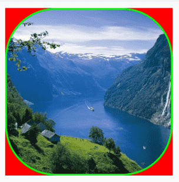
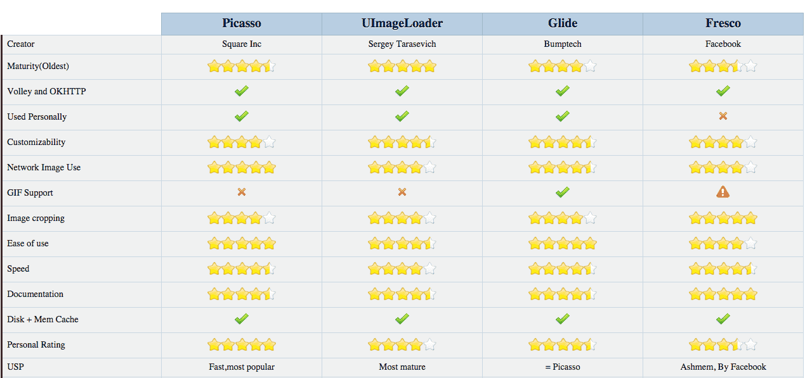

# 图像
--------------
### 1 universal-image-loader

* 主页: https://github.com/nostra13/Android-Universal-Image-Loader

* 功能

		1. 多线程下载图片，图片可以来源于网络，文件系统，项目文件夹assets中以及drawable中等
		2. 支持随意的配置ImageLoader，例如线程池，图片下载器，内存缓存策略，硬盘缓存策略，图片显示选项以及其他的一些配置
		3. 支持图片的内存缓存，文件系统缓存或者SD卡缓存
		4. 支持图片下载过程的监听
		5. 根据控件(ImageView)的大小对Bitmap进行裁剪，减少Bitmap占用过多的内存
		6. 较好的控制图片的加载过程，例如暂停图片加载，重新开始加载图片，一般使用在ListView,GridView中，滑动过程中暂停加载图片，停止滑动的时候去加载图片
		7. 提供在较慢的网络下对图片进行加载

* 使用步骤:
	1. 添加依赖: compile 'com.nostra13.universalimageloader:universal-image-loader:1.9.5'
	2. 添加权限:
	
		-　<uses-permission android:name="android.permission.INTERNET" />		
		-　<uses-permission android:name="android.permission.WRITE_EXTERNAL_STORAGE" />

	3. 编写步骤：
	
			//初始化imageloader
	        ImageLoader imageLoader = ImageLoader.getInstance();
	        //初始化参数
	        ImageLoaderConfiguration config = ImageLoaderConfiguration.createDefault(this);
	        imageLoader.init(config);
	        //设置显示图片的样式
	        //圆形
	        DisplayImageOptions options = new DisplayImageOptions.Builder()
	                .displayer(new CircleBitmapDisplayer())
	                .build();
	     
	        //展示图片
	        imageLoader.displayImage("file:///sdcard/Download/mm.jpg",iv,options);

	4. 图片样式:
		1. 显示圆形图片.使用该效果,必须显式指定图片的宽高

				DisplayImageOptions options = new DisplayImageOptions.Builder()
				 		.displayer(new CircleBitmapDisplayer())
				 		.build();
		2. 显示圆角图片.使用该效果,必须显式指定图片的宽高
		
		        DisplayImageOptions options = new DisplayImageOptions.Builder()
		                .displayer(new RoundedBitmapDisplayer(90))
		                .build();
		3. 显示圆角缩放图片.使用该效果,必须显式指定图片的宽高

		        DisplayImageOptions options = new DisplayImageOptions.Builder()
		                .displayer(new RoundedVignetteBitmapDisplayer(90,180))
		                .build();
		4. 透明度渐显图片

		        DisplayImageOptions options = new DisplayImageOptions.Builder()
		                .displayer(new FadeInBitmapDisplayer(3000))
		                .build();

### 2 Fresco
	
* FaceBook推出的图片处理框架

* 主页: https://github.com/facebook/fresco

* 中文文档:http://fresco-cn.org/docs/index.html

* 功能
	
		在XML中使用 Drawees
		在Java代码中使用 Drawees
		Drawee的各种效果配置
			进度条
			缩放
			圆角/圆圈
			渐进式JPEG图
			动画图(gif)
			多图请求及图片复用
			监听下载事件
			缩放和旋转
		
* 使用步骤

	1. 添加依赖: compile 'com.facebook.fresco:fresco:0.9.0+'
	2. 添加权限 

			<uses-permission android:name="android.permission.INTERNET"/>

	3. 在Application初始化或在Activity 的**setContentView()方法之前**，进行初始化

        	Fresco.initialize(this);

	4. 在布局文件中添加图片控件.宽高必须显示指定,否则图片无法显示.

		    <com.facebook.drawee.view.SimpleDraweeView
		        android:id="@+id/my_image_view"
		        android:layout_width="200dp"
		        android:layout_height="200dp"
		        fresco:placeholderImage="@mipmap/ic_launcher" /> //设置默认加载的图片

	5. 在Java代码中指定图片的路径.显示图片.SimpleDraweeView接收的路径参数为URI,所以需要一次转换.

	        SimpleDraweeView view = (SimpleDraweeView) findViewById(R.id.my_image_view);
	        view.setImageURI(Uri.parse("file:///sdcard/Download/mm.jpg"));

	6. XML方式配置参数.除图片地址以外,其他所有显示选项都可以在布局文件中指定

		    <com.facebook.drawee.view.SimpleDraweeView
		        android:id="@+id/my_image_view"
		        android:layout_width="200dp"
		        android:layout_height="200dp"
		        fresco:fadeDuration="300" 			// 渐显图片的时间
		        fresco:failureImage="@drawable/err" // 图片加载失败显示的图片

		        fresco:roundAsCircle="true" 			// 显示圆形图片
		        fresco:roundWithOverlayColor="#999999" 	// 设置图片圆角后空出区域的颜色.如示例图中的红色部分
		        fresco:roundedCornerRadius="10dp"		// 设置图片圆角角度,设置该属性后四个角都会生效
		        fresco:roundingBorderColor="#f00" 		// 设置圆角后,边框的颜色.
		        fresco:roundingBorderWidth="5dp" />     // 设置圆角后,外边框的宽高

		

	7. Java代码配置参数.

				设置默认的图片
		        GenericDraweeHierarchy hierarchy = GenericDraweeHierarchyBuilder
		                .newInstance(getResources())
		                .setRetryImage(getResources().getDrawable(R.mipmap.ic_launcher))
		                .build();
		
		        imageivew.setHierarchy(hierarchy);

	8. 显示GIF图片.Fresco 支持 GIF 和 WebP 格式的动画图片.如果你希望图片下载完之后自动播放，同时，当View从屏幕移除时，停止播放，只需要在 image request 中简单设置，示例代码:

		     SimpleDraweeView imageView = (SimpleDraweeView) findViewById(R.id.iv_gif);
	        //设置显示gif图的控制器
	        DraweeController controller = Fresco.newDraweeControllerBuilder()
	                .setUri(Uri.parse("http://192.168.13.77:8080/nice/fresco.gif"))
	                .setAutoPlayAnimations(true) //播放gif图片
	                .build();
	        //显示gif图
	        imageView.setController(controller);

### 3 Picasso	

* 主页: https://github.com/square/picasso

* 使用步骤
	1. 添加依赖 compile 'com.squareup.picasso:picasso:2.5.2'
	2. 添加权限: 

			<uses-permission android:name="android.permission.INTERNET"/>

	3. 加载图片,示例代码:

			Picasso
	                .with(this)		 // 指定Context
	                .load("http://192.168.1.100:8080/nice/mm.jpg") //指定图片URL
	                .placeholder(R.mipmap.ic_launcher)			   //指定图片未加载成功前显示的图片
	                .error(R.mipmap.ic_launcher)				   // 指定图片加载失败显示的图片
	                .resize(300, 300)// 指定图片的尺寸	               
	                .memoryPolicy(MemoryPolicy.NO_CACHE, MemoryPolicy.NO_STORE)// 指定内存缓存策略
	                .into(imageView); // 指定显示图片的ImageView

	4. 圆形图片

		        // 自定义Transformation
		        Transformation transform = new Transformation() {
		            @Override
		            public Bitmap transform(Bitmap source) {
		                int size = Math.min(source.getWidth(), source.getHeight());
		                int x = (source.getWidth() - size) / 2;
		                int y = (source.getHeight() - size) / 2;
		                Bitmap squaredBitmap = Bitmap.createBitmap(source, x, y, size, size);
		                if (squaredBitmap != source) {
		                    source.recycle();
		                }
		                Bitmap bitmap = Bitmap.createBitmap(size, size, source.getConfig());
		                Canvas canvas = new Canvas(bitmap);
		                Paint paint = new Paint();
		                BitmapShader shader = new BitmapShader(squaredBitmap,
		                        BitmapShader.TileMode.CLAMP, BitmapShader.TileMode.CLAMP);
		                paint.setShader(shader);
		                paint.setAntiAlias(true);
		                float r = size / 2f;
		                canvas.drawCircle(r, r, r, paint);
		                squaredBitmap.recycle();
		                return bitmap;
		            }
		
		            @Override
		            public String key() {
		                return "circle";
		            }
		        };

		        Picasso
		                .with(this)// 指定Context
		                .load(URL_IMG2) //指定图片URL
		                .transform(transform) // 指定图片转换器
		                .into(imageView); // 指定显示图片的ImageView

	5. 圆角图片

			class RoundedTransformation implements com.squareup.picasso.Transformation {
			    private final int radius;
			    private final int margin;  // dp
			
			    // radius is corner radii in dp
			    // margin is the board in dp
			    public RoundedTransformation(final int radius, final int margin) {
			        this.radius = radius;
			        this.margin = margin;
			    }
			
			    @Override
			    public Bitmap transform(final Bitmap source) {
			        final Paint paint = new Paint();
			        paint.setAntiAlias(true);
			        paint.setShader(new BitmapShader(source, Shader.TileMode.CLAMP, Shader.TileMode.CLAMP));
			
			        Bitmap output = Bitmap.createBitmap(source.getWidth(), source.getHeight(), Bitmap.Config.ARGB_8888);
			        Canvas canvas = new Canvas(output);
			        canvas.drawRoundRect(new RectF(margin, margin, source.getWidth() - margin, source.getHeight() - margin), radius, radius, paint);
			
			        if (source != output) {
			            source.recycle();
			        }
			
			        return output;
			    }
			
			    @Override
			    public String key() {
			        return "rounded(radius=" + radius + ", margin=" + margin + ")";
			    }
			}
	        Picasso
	                .with(this)// 指定Context
	                .load(URL_IMG2) //指定图片URL
	                .transform(new RoundedTransformation(360,0)) // 指定图片转换器
	                .into(imageView); // 指定显示图片的ImageView

###  4 Glide
	
* 主页: https://github.com/bumptech/glide

* 中文文档: http://mrfu.me/2016/02/27/Glide_Getting_Started/

* 使用步骤
	1. 添加依赖 compile 'com.github.bumptech.glide:glide:3.7.0' 
		同时还依赖于supportV4.如果没有请自行添加

	2. 添加权限: 
			<uses-permission android:name="android.permission.INTERNET"/>

	3. 加载图片.示例代码:

	        Glide
	            .with(this) // 指定Context
	            .load(URL_GIF)// 指定图片的URL
	            .placeholder(R.mipmap.ic_launcher)// 指定图片未成功加载前显示的图片
	            .error(R.mipmap.ic_launcher)// 指定图片加载失败显示的图片
	            .override(300, 300)//指定图片的尺寸
				.skipMemoryCache(true)// 跳过内存缓存
	            .diskCacheStrategy(DiskCacheStrategy.NONE)//跳过磁盘缓存	                
	            .into(imageView);//指定显示图片的ImageView

	4. 显示圆形图片

			class GlideCircleTransform extends BitmapTransformation {
			    public GlideCircleTransform(Context context) {
			        super(context);
			    }
			
			    @Override
			    protected Bitmap transform(BitmapPool pool, Bitmap toTransform, int outWidth, int outHeight) {
			        return circleCrop(pool, toTransform);
			    }
			
			    private Bitmap circleCrop(BitmapPool pool, Bitmap source) {
			        if (source == null) return null;
			
			        int size = Math.min(source.getWidth(), source.getHeight());
			        int x = (source.getWidth() - size) / 2;
			        int y = (source.getHeight() - size) / 2;
			
			        // TODO this could be acquired from the pool too
			        Bitmap squared = Bitmap.createBitmap(source, x, y, size, size);
			
			        Bitmap result = pool.get(size, size, Bitmap.Config.ARGB_8888);
			        if (result == null) {
			            result = Bitmap.createBitmap(size, size, Bitmap.Config.ARGB_8888);
			        }
			
			        Canvas canvas = new Canvas(result);
			        Paint paint = new Paint();
			        paint.setShader(new BitmapShader(squared, BitmapShader.TileMode.CLAMP, BitmapShader.TileMode.CLAMP));
			        paint.setAntiAlias(true);
			        float r = size / 2f;
			        canvas.drawCircle(r, r, r, paint);
			        return result;
			    }
			
			    @Override
			    public String getId() {
			        return getClass().getName();
			    }
			}

	        Glide
	                .with(this) // 指定Context
	                .load(URL_GIF)// 指定图片的URL
	                .transform(new GlideCircleTransform(this)) // 指定自定义图片样式
	                .into(imageView);//指定显示图片的ImageView

	5. 显示圆角图片

			class GlideRoundTransform extends BitmapTransformation {

	            private  float radius = 0f;
	
	            public GlideRoundTransform(Context context) {
	                this(context, 4);
	            }
	
	            public GlideRoundTransform(Context context, int dp) {
	                super(context);
	                this.radius = Resources.getSystem().getDisplayMetrics().density * dp;
	            }
	
	            @Override protected Bitmap transform(BitmapPool pool, Bitmap toTransform, int outWidth, int outHeight) {
	                return roundCrop(pool, toTransform);
	            }
	
	            private Bitmap roundCrop(BitmapPool pool, Bitmap source) {
	                if (source == null) return null;
	
	                Bitmap result = pool.get(source.getWidth(), source.getHeight(), Bitmap.Config.ARGB_8888);
	                if (result == null) {
	                    result = Bitmap.createBitmap(source.getWidth(), source.getHeight(), Bitmap.Config.ARGB_8888);
	                }
	
	                Canvas canvas = new Canvas(result);
	                Paint paint = new Paint();
	                paint.setShader(new BitmapShader(source, BitmapShader.TileMode.CLAMP, BitmapShader.TileMode.CLAMP));
	                paint.setAntiAlias(true);
	                RectF rectF = new RectF(0f, 0f, source.getWidth(), source.getHeight());
	                canvas.drawRoundRect(rectF, radius, radius, paint);
	                return result;
	            }
	
	            @Override public String getId() {
	                return getClass().getName() + Math.round(radius);
	            }
	        }

	        Glide
	                .with(this) // 指定Context
	                .load(URL_GIF)// 指定图片的URL
	                .transform(new GlideRoundTransform(this,30)) // 指定自定义图片样式
	                .into(imageView);//指定显示图片的ImageView

###图像库对比
* 快速加载图片推荐Glide
* 对图片质量要求较高推荐Picasso
* 如果应用加载的图片很多,推荐Fresco > Glide > Picasso

