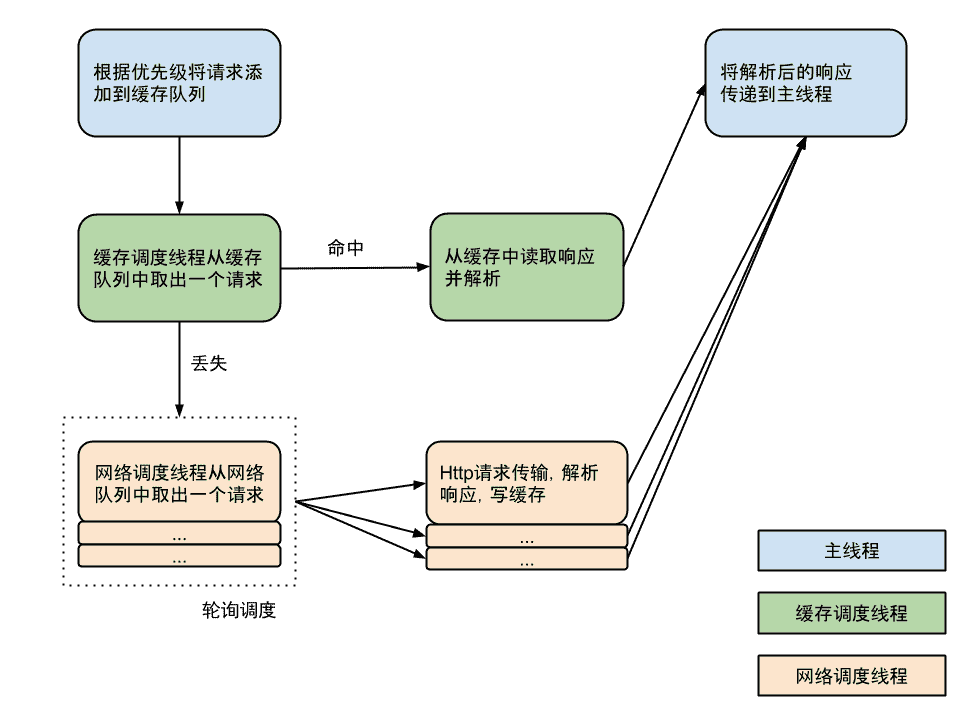
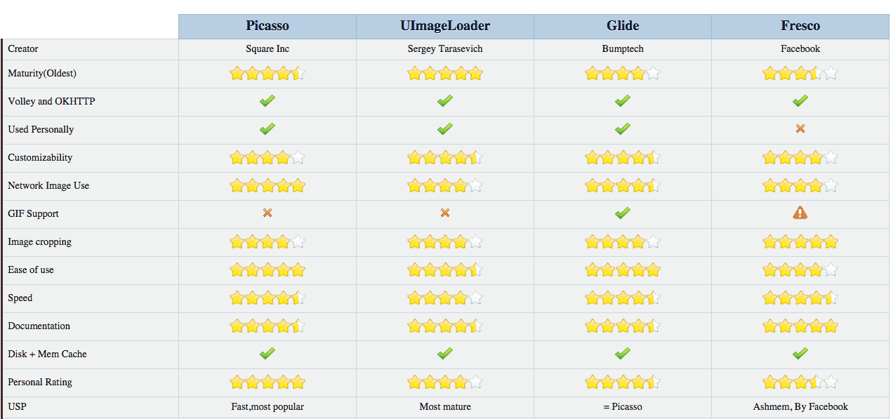

## 0.1为什么要使用开源框架

1. 提高开发速度
2. 提高开发质量

## 0.2选择开源框架的原则

1. 聚合性框架一定要放弃.例如Afinal，xUtils
	* 大而全的框架容易导致牵一发而动全身.可读性差,耦合高,难扩展.

2. last commit超过一年以上或者issues一大堆没有fix的框架不要用.

3. 选择活跃度和人气高的项目

# 常见开源库

# 依赖注入
--------
### 1.1依赖注入_概念

* 依赖(Dependency)

	* 如果在ClassA中用到了ClassB的实例,我们通常会直接new一个ClassB的对象,这种情况称为调用者ClassA对被调用者ClassB有一个依赖
	* 例如下面的代码中HRSystem就依赖与Person.
	* 示例代码中Person这种直接初始化的方式也叫Hard Init方式,弊端在于两个类之间不够独立,如果我们更改了Person的构造函数,所有使用到Person初始化方法的代码都要进行修改.

			public class HRSystem {
			
				public static void main(String[] args) {
					Person person = new Person();
			
				}
			}

* 依赖注入(DI:Dependency Injection):

	* 指程序运行过程中,调用者(HRSystem)需要被调用者(Person)的辅助,但是创建被调用者(Person)的工作不再由调用者(HRSystem)来完成,因此称为**控制反转(IOC:Inversion of Control)**,而是由相关的容器控制程序将被调用者(Person)的对象在外部创建出来并注入到调用者(HRSystem)的引用中

			public class HRSystem {

				@Inject
				Person person;

				public static void main(String[] args) {
				}
			}

* 为什么要使用依赖注入

	* 依赖注入是实现控制反转的方式之一(另一方式是依赖查找),目的就是为了让调用者和被调用者之间解耦
	* 可以注入依赖的模拟实现,使得测试变得更加简单.

### 1.2依赖注入_Butterknife  

* 主页: [https://github.com/JakeWharton/butterknife](https://github.com/JakeWharton/butterknife "https://github.com/JakeWharton/butterknife")
* 用途: 主要用来简化各种初始化控件的操作
* 配置:
	1. 在app/build.gradle文件中dependencies节点添加如下代码
		* compile 'com.jakewharton:butterknife:7.0.1'
	2. 在Android Studio中点击 File-->Settings-->Plugins-->Browse repositories,搜索Android ButterKnife Zelezny插件,安装成功以后重启Android Studio.
	3. 在布局文件中添加控件的时候,所有需要在Activity/Fragment代码中进行控制的控件都要添加id属性
	4. 在Activity/Fragment 代码中,将鼠标放在布局文件的引用上(即R.layout.activity_main中的activity_main上面),此时按快捷键Alt + Insert或鼠标右键选择Generate
	5. 在弹出的菜单中选择Generate ButterKnife Injections,此时会再次弹出一个对话框
	6. 新的对话框中点击confirm后直接生成控件的引用,代替findViewById
	7. 如果需要处理控件的点击事件,可以选择对应控件的OnClick复选框.
	8. 如果是ListView的Item视图,还可以选择左下角的Create ViewHolder复选框,生成ViewHolder静态类.

* 技巧
	* 在AndroidStudio\plugins\android\lib\templates\gradle-projects\NewAndroidModule\recipe.xml.ftl中添加如下代码,以后新创建的工程默认会添加Butterknife依赖:

			<dependency mavenUrl="com.jakewharton:butterknife:7.0.1" />

### 1.3依赖注入_AndroidAnnotations 

* 主页: [http://androidannotations.org/](http://androidannotations.org/)
* 用途: 
	1. 使用依赖注入Views,extras,System Service,resources
	2. 简化线程模型
	3. 事件绑定
	4. REST Client
* 配置:
	1. 在project/build.gradle 文件中按下图所示添加代码:
	
				mavenCentral()
				classpath 'com.neenbedankt.gradle.plugins:android-apt:1.8'
				mavenCentral()
				mavenLocal()
		
	2. 在app/build.gradle 文件中按下图所示添加代码:

				apply plugin: 'android-apt'
				apt {
				    arguments {
				        androidManifestFile variant.outputs[0]?.processResources?.manifestFile
				    }
				}
				apt "org.androidannotations:androidannotations:4.0.0"
				compile "org.androidannotations:androidannotations-api:4.0.0"
					

* 注意事项:

		* Manifest中注册的activity要在原类名后追加下划线”_”
		* 使用注解的控件和方法不能使用private修饰符	
		* 大型项目并不适用

### 1.4依赖注入_Dagger2 
* 主页: [https://github.com/google/dagger](https://github.com/google/dagger )

* 历史: 
	* Dagger1是由Square公司受到Guice([https://github.com/google/guice](https://github.com/google/guice))启发创建的依赖注入框架.
	* Dagger2是Dagger1([https://github.com/square/dagger](https://github.com/square/dagger))的分支，由谷歌开发.该项目受到了Auto项目([https://github.com/google/auto](https://github.com/google/auto))的启发
	* Dagger2的优点
		* 没有使用反射,图的验证、配置和预先设置都在编译的时候执行
		* 容易调试,完全具体地调用提供和创建的堆栈
		* 更高的性能,谷歌声称他们提高了13%的处理性能
		* 代码混淆,使用派遣方法，就如同自己写的代码一样
  
* 配置:
	1. 在project/build.gradle 文件中按下图所示添加代码:  classpath 'com.neenbedankt.gradle.plugins:android-apt:1.8'
	
	2. 在app/build.gradle 文件中按下图所示添加代码:
	
			* apply plugin: 'com.neenbedankt.android-apt'
			* compile 'com.google.dagger:dagger:2.2'
        	* apt 'com.google.dagger:dagger-compiler:2.2'
        	* provided 'org.glassfish:javax.annotation:10.0-b28'
	

* 主要的注解:
	* @Provides: 用来修饰方法，方法的返回类型就是所提供的依赖类型，可以简单的把方法的返回值理解为我们通常要new出来的对象.
		* @Provides方法都会用provide作为前缀
	* @Module: 所有的@Provides方法都必须放到一个Moudle中,一个Moudle就是使用@Moudle修饰的类,可以简单的理解为一个持有各种对象的仓库.用来给@Component组件提供实例化的对象.
		* Android中有三种Module:ApplicationModule，ActivityModule，UserModule,分别提供整个应用级别的（只生成一个该组件的实例），Activity级别的，用户级别的Module。
		* @Module类都用Module作为后缀
	* @Inject: 通常在需要依赖的地方使用这个注解,简单的理解为声明一个对象
	* @Component 它是@Inject和@Module的桥梁，它的主要作用就是连接这两个部分.
		* 我们必须用@Component注解一个接口,为该注解传入Module类，或者添加其依赖的组件
		* @Component注解的接口或抽象类以Component为后缀
	* @Component的实现类
		* @Component注解的接口或抽象类，Dagger将会为该接口或者抽象类生成一个实现，这个实现的命名是在接口或抽象类前面加上Dagger，如MyComponent生成的实现是DaggerMyComponent

* 使用步骤:
	1. 创建Module,并在其中创建Provides.示例代码:

			@Module
			public class MainActivityModuel {
			
			    @Provides
			    User provideUser(){
			        return  new User("zhangsan", 12,"18612345678");
			    }
			}
	2. 创建Component.示例代码:

			@Component(modules = MainActivityModuel.class)
			public interface MainActivityComponent {
			    void inject(MainActivity activity);
			}

	3. Rebuild工程,生成对应的以Dagger开始的工具类
	4. 利用对应的以Dagger工具类初始化,并注入对象.示例代码:

			public class MainActivity extends AppCompatActivity {
			    @Inject
			    User user;
			
			    @Override
			    protected void onCreate(Bundle savedInstanceState) {
			        super.onCreate(savedInstanceState);
			        setContentView(R.layout.activity_main);
			        MainActivityComponent component = DaggerMainActivityComponent.builder().mainActivityModuel(new MainActivityModuel()).build();
			        component.inject(this);
			    }
			}

# 网络
-------------
### 2.1网络_Volley 

* 主页:[https://android.googlesource.com/platform/frameworks/volley/](https://android.googlesource.com/platform/frameworks/volley/ )

* 特点: 
	* 通信更快,更简单
	* 支持网络请求的排序,优先级处理
	* 支持网络请求的缓存
	* 多级别的取消请求
	* 扩展性强

* 使用步骤:
	1. 创建RequestQueue
	2. 创建Request
	3. 添加Request到RequestQueue
	
* 注意事项: 
	* 如果自己编译Volley的话,compileSdkVersion需要<=22,这是因为在Android6.0中Google移除了httpClient相关的API
	* Volley仅适合用于通信频繁数据量小的网络操作
	* 大数据量的网络操作并不适合Volley
	* 生成的jar文件地址:
		* \build\intermediates\bundles\release\classes.jar

	* 生成的aar文件地址:
		* \build\outputs\aar

* 工作原理图

	

* 使用步骤:
	1. 创建RequestQueue
	2. 创建Request对象
	3. 添加Request对象到RequestQueue中

### 2.2网络_Okhttp	
* 主页: [https://github.com/square/okhttp](https://github.com/square/okhttp)
* 配置: 添加依赖 compile 'com.squareup.okhttp3:okhttp:3.2.0'
* 特点:
	* 支持HTTP/2 和 SPDY
	* 默认支持 GZIP 降低传输内容的大小
	* 支持网络请求的缓存
	* 当网络出现问题时,自动重试一个主机的多个 IP 地址
	
* 使用步骤:
	1. 创建OkHttpClient对象
	2. 创建Request对象
	3. 添加Request对象到OkHttpClient对象中并执行请求.示例代码:

				OkHttpClient client=new OkHttpClient();
                RequestBody body = new FormBody.Builder()
                        .add("phone", "13812345678")// 构造请求的参数
                        .add("key", "daf8fa858c330b22e342c882bcbac622")// 构造请求的参数
                        .build();
                Request post_request = new Request.Builder()
                        .url(URL_POST)// 指定请求的地址
                        .post(body)// 指定请求的方式为POST
                        .build();
                client.newCall(post_request).enqueue(new Callback() {
                    @Override
                    public void onFailure(Call call, IOException e) {
                        // 请求失败的处理
                    }

                    @Override
                    public void onResponse(Call call, Response response) throws IOException {	// 请求成功的处理
                        ResponseBody body = response.body();
                        String string = body.string();// 把返回的结果转换为String类型
						// body.bytes();// 把返回的结果转换为byte数组
						// body.byteStream();// 把返回的结果转换为流
                    }
                });
	

* 因为原生OkHttp的使用比较复杂,有一个包装过的工具项目okhttp-utils使用非常简单
	* 添加依赖: compile 'com.zhy:okhttputils:2.3.8'
	* 工具类简介:[https://github.com/hongyangAndroid/okhttp-utils](https://github.com/hongyangAndroid/okhttp-utils)

### 2.3网络_Retrofit	 
* 主页: [https://github.com/square/retrofit](https://github.com/square/retrofit)
* 注意: 使用Retrofit的前提是**服务器端代码遵循REST规范 !!!!!**
* 功能: 
	* 效率非常高
	* 可以直接将结果转换称Java类
	* 主要是配合RxJava一起使用
* 配置: 
	* 添加Retrofit依赖: compile 'com.squareup.retrofit2:retrofit:2.0.2'
	* 添加数据解析依赖,根据实际情况进行选择
		* Gson : com.squareup.retrofit2:converter-gson:2.0.2
		* Jackson : com.squareup.retrofit2:converter-jackson:2.0.2
		* Moshi : com.squareup.retrofit2:converter-moshi:2.0.2
		* Protobuf : com.squareup.retrofit2:converter-protobuf:2.0.2
		* Wire : com.squareup.retrofit2:converter-wire:2.0.2
		* Simple XML : com.squareup.retrofit2:converter-simplexml:2.0.2

* 使用步骤: 
	1. 利用[http://www.jsonschema2pojo.org/](http://www.jsonschema2pojo.org/)创建数据模型
	2. 创建REST API 接口
		* 常用注解:
			* 请求方法:@GET / @POST / @PUT / @DELETE / @HEAD
			* URL处理
				* @Path - 替换参数
				
						@GET("/group/{id}/users")
						public Call<List<User>> groupList(@Path("id") int groupId);
				* @Query - 添加查询参数
				
						@GET("/group/{id}/users")
						public Call<List<User>> groupList(@Path("id") int groupId, @Query("sort") String sort);
				* @QueryMap - 如果有多个查询参数，把它们放在Map中

						@GET("/group/{id}/users")
						public Call<List<User>> groupList(@Path("id") int groupId, @QueryMap Map<String, String> options);
		* 示例代码:

				public interface NetAPI {
				    @GET("/users/{user}")
				    public Call<GitModel> getFeed(@Path("user") String user);
				
				    @GET("/service/getIpInfo.php")
				    public Call<IPModel> getWeather(@Query("city")String city);
				}
	3. 创建Retrofit对象, 并发起请求.示例代码:

	        // 构建Retrofit实例
	        Retrofit retrofit = new Retrofit.Builder().
	                baseUrl(API2).
	                addConverterFactory(GsonConverterFactory.create()).
	                build();
	        // 构建接口的实现类
	        IpAPI weatherAPI = retrofit.create(IpAPI.class);
	        // 调用接口定义的方法
	        Call<IPModel> weatherCall = weatherAPI.getWeather("8.8.8.8");
	        // 异步执行请求
	        weatherCall.enqueue(new Callback<IPModel>() {
	            @Override
	            public void onResponse(Call<IPModel> call, Response<IPModel> response) {
	                IPModel model = response.body();
	                System.out.println("country:" + model.getData().getCountry());
	            }
	
	            @Override
	            public void onFailure(Call<IPModel> call, Throwable t) {
	                System.out.println(t.toString());
	            }
	        });

* 优点: 

## 图像

### 3.1图像_UIL 
* 主页: [https://github.com/nostra13/Android-Universal-Image-Loader](https://github.com/nostra13/Android-Universal-Image-Loader)
* 使用步骤:
	1. 添加依赖: compile 'com.nostra13.universalimageloader:universal-image-loader:1.9.5'
	2. 添加权限:
	
		-　<uses-permission android:name="android.permission.INTERNET" />
		
		-　<uses-permission android:name="android.permission.WRITE_EXTERNAL_STORAGE" />
	3. 在Application或Activity中进行初始化配置
	
			// ImageLoaderConfiguration 详细配置
			File cacheDir = StorageUtils.getOwnCacheDirectory(getApplicationContext(), "imageloader/Cache"); // 自定义缓存文件夹
			ImageLoaderConfiguration config = new ImageLoaderConfiguration.Builder(context)
			     .memoryCacheExtraOptions(480, 800) // 指定缓存到内存时图片的大小,默认是屏幕尺寸的长宽
			     .diskCacheExtraOptions(480, 800, null) // 指定缓存到硬盘时图片的大小,并不建议使用
			     .taskExecutor(new Executor()) // 自定义一个线程来加载和显示图片
			     .taskExecutorForCachedImages(new Executor())// 自定义一个线程来缓存图片
			     .threadPoolSize(3) // default, 指定线程池大小
			     .threadPriority(Thread.NORM_PRIORITY - 2) // default ,指定线程优先级 
			     .tasksProcessingOrder(QueueProcessingType.FIFO) // default , 指定加载显示图片的任务队列的类型
			     .denyCacheImageMultipleSizesInMemory() // 禁止在内存中缓存同一张图片的多个尺寸类型
			     .memoryCache(new LruMemoryCache(2 * 1024 * 1024)) // 指定内存缓存的大小,默认值为1/8 应用的最大可用内存
			     .memoryCacheSize(2 * 1024 * 1024) 
			     .memoryCacheSizePercentage(13) // default
			     .diskCache(new UnlimitedDiskCache(cacheDir)) // default , 指定硬盘缓存的地址
			     .diskCacheSize(50 * 1024 * 1024) // 指定硬盘缓存的大小
			     .diskCacheFileCount(100) // 指定硬盘缓存的文件个数
			     .diskCacheFileNameGenerator(new HashCodeFileNameGenerator()) // default , 指定硬盘缓存时文件名的生成器
			     .imageDownloader(new BaseImageDownloader(context)) // default , 指定图片下载器
			     .imageDecoder(new BaseImageDecoder()) // default , 指定图片解码器
			     .defaultDisplayImageOptions(DisplayImageOptions.createSimple()) // default , 指定图片显示的配置
			     .writeDebugLogs() // 是否显示Log
			     .build();

			// ImageLoaderConfiguration 简单初始化
			ImageLoaderConfiguration configuration = ImageLoaderConfiguration.createDefault(this);
			// 初始化配置
			ImageLoader.getInstance().init(configuration);  

	4. DisplayImageOptions 参数详解:

			DisplayImageOptions options = new DisplayImageOptions.Builder()
				.showImageOnLoading(R.drawable.ic_stub) // 图片正在加载时显示的图片资源ID
				.showImageForEmptyUri(R.drawable.ic_empty) // URI为空时显示的图片资源ID
				.showImageOnFail(R.drawable.ic_error) // 图片加载失败时显示的图片资源ID
				.resetViewBeforeLoading(false)  // default 图片在下载前是否重置,复位
				.delayBeforeLoading(1000) // 图片开始加载前的延时.默认是0
				.cacheInMemory(false) // default , 是否缓存在内存中, 默认不缓存
				.cacheOnDisk(false) // default , 是否缓存在硬盘 , 默认不缓存
				.preProcessor(new BitmapProcessor) // 设置图片缓存在内存前的图片处理器
				.postProcessor(new BitmapProcessor) // 设置图片在缓存到内存以后 , 显示在界面之前的图片处理器
				.extraForDownloader(...) // 为图片下载设置辅助参数
				.considerExifParams(false) // default , 设置是否考虑JPEG图片的EXIF参数信息,默认不考虑
				.imageScaleType(ImageScaleType.IN_SAMPLE_POWER_OF_2) // default , 指定图片缩放的方式,ListView/GridView/Gallery推荐使用此默认值
				.bitmapConfig(Bitmap.Config.ARGB_8888) // default , 指定图片的质量,默认是 ARGB_8888
				.decodingOptions(...) // 指定图片的解码方式
				.displayer(new SimpleBitmapDisplayer()) // default , 设置图片显示的方式,用于自定义
				.handler(new Handler()) // default ,设置图片显示的方式和ImageLoadingListener的监听, 用于自定义
				.build();

	5. 显示图片的方法:

			ImageLoader.getInstance().loadImage(String uri, ImageLoadingListener listener)  
			
				displayImage(String uri, ImageView imageView)
				displayImage(String uri, ImageView imageView, DisplayImageOptions options)
				displayImage(String uri, ImageView imageView, DisplayImageOptions options,
				ImageLoadingListener listener, ImageLoadingProgressListener progressListener) 
	6. 特殊用法:
		1. 显示圆形图片.使用该效果,必须显式指定图片的宽高

				DisplayImageOptions options = new DisplayImageOptions.Builder()
				 		.displayer(new CircleBitmapDisplayer())
				 		.build();
		2. 显示圆角图片.使用该效果,必须显式指定图片的宽高
		
		        DisplayImageOptions options = new DisplayImageOptions.Builder()
		                .displayer(new RoundedBitmapDisplayer(90))
		                .build();
		3. 显示圆角缩放图片.使用该效果,必须显式指定图片的宽高

		        DisplayImageOptions options = new DisplayImageOptions.Builder()
		                .displayer(new RoundedVignetteBitmapDisplayer(90,180))
		                .build();
		4. 显示渐显图片

		        DisplayImageOptions options = new DisplayImageOptions.Builder()
		                .displayer(new FadeInBitmapDisplayer(3000))
		                .build();

### 3.2图像_Fresco	
* 主页: [https://github.com/facebook/fresco](https://github.com/facebook/fresco)
* 中文文档: [http://fresco-cn.org/docs/index.html](http://fresco-cn.org/docs/index.html)
* 使用步骤
	1. 添加依赖: compile 'com.facebook.fresco:fresco:0.9.0+'
	2. 添加权限 

			<uses-permission android:name="android.permission.INTERNET"/>
	3. 在Application初始化或在Activity 的setContentView()方法之前，进行初始化

        	Fresco.initialize(this);
	4. 在布局文件中添加图片控件.宽高必须显示指定,否则图片无法显示.

		    <com.facebook.drawee.view.SimpleDraweeView
		        android:id="@+id/my_image_view"
		        android:layout_width="200dp"
		        android:layout_height="200dp"
		        fresco:placeholderImage="@mipmap/ic_launcher" />
	5. 在Java代码中指定图片的路径.显示图片.SimpleDraweeView接收的路径参数为URI,所以需要一次转换.

	        Uri uri = Uri.parse(URL_IMG2);
	        SimpleDraweeView view = (SimpleDraweeView) findViewById(R.id.my_image_view);
	        view.setImageURI(uri);

	6. XML方式配置参数.除图片地址以外,其他所有显示选项都可以在布局文件中指定

		    <com.facebook.drawee.view.SimpleDraweeView
		        android:id="@+id/my_image_view"
		        android:layout_width="20dp"
		        android:layout_height="20dp"
		        fresco:actualImageScaleType="focusCrop"// 图片的缩放方式.
		        fresco:backgroundImage="@color/blue" //背景图.不支持缩放.XML仅能指定一张背景图.如果使用Java代码指定的话,可以指定多个背景,显示方式类似FrameLayout,多个背景图按照顺序一级一级层叠上去.
		        fresco:fadeDuration="300" // 渐显图片的时间
		        fresco:failureImage="@drawable/error" // 图片加载失败显示的图片
		        fresco:failureImageScaleType="centerInside" //// 图片加载失败显示的图片的缩放类型
		        fresco:overlayImage="@drawable/watermark" // 层叠图,最后叠加在图片之上.不支持缩放.XML仅能指定一张.如果使用Java代码指定的话,可以指定多个,显示方式类似FrameLayout,多个图按照顺序一级一级层叠上去.
		        fresco:placeholderImage="@color/wait_color"  // 图片加载成功之前显示的占位图
		        fresco:placeholderImageScaleType="fitCenter" // 图片加载成功之前显示的占位图的缩放类型
		        fresco:pressedStateOverlayImage="@color/red" // 设置按压状态下的层叠图.不支持缩放.
		        fresco:progressBarAutoRotateInterval="1000" // 进度条图片旋转显示时长
		        fresco:progressBarImage="@drawable/progress_bar" // 进度条图片
		        fresco:progressBarImageScaleType="centerInside" //进度条图片的缩放类型
		        fresco:retryImage="@drawable/retrying" // 当图片加载失败的时候,显示该图片提示用户点击重新加载图片
		        fresco:retryImageScaleType="centerCrop" // 提示图片的缩放类型
		        fresco:roundAsCircle="false" // 显示圆形图片
		        fresco:roundBottomLeft="false" // roundedCornerRadius属性设置后,四个角都会有圆角,如果左下角不需要设置为false.
		        fresco:roundBottomRight="true" // roundedCornerRadius属性设置后,四个角都会有圆角,如果右下角不需要设置为false.
		        fresco:roundTopLeft="true" // roundedCornerRadius属性设置后,四个角都会有圆角,如果左上角不需要设置为false.
		        fresco:roundTopRight="false" // roundedCornerRadius属性设置后,四个角都会有圆角,如果右上角不需要设置为false.
		        fresco:roundWithOverlayColor="@color/corner_color" // 设置图片圆角后空出区域的颜色.如示例图中的红色部分
		        fresco:roundedCornerRadius="1dp" // 设置图片圆角角度,设置该属性后四个角都会生效
		        fresco:roundingBorderColor="@color/border_color" // 设置圆角后,边框的颜色.
		        fresco:roundingBorderWidth="2dp" /> // 设置圆角后,外边框的宽高

		

	7. Java代码配置参数.
	
		        GenericDraweeHierarchy hierarchy = GenericDraweeHierarchyBuilder
		                .newInstance(getResources())
		                .setRetryImage(getResources().getDrawable(R.mipmap.ic_launcher))
		                .build();
		
		        imageivew.setHierarchy(hierarchy);

	8. 特殊用法:
	
		1. 显示渐进式JPEG图片

		        ProgressiveJpegConfig pjpegConfig = new ProgressiveJpegConfig() {
		            @Override
		            // 返回下一个需要解码的扫描次数
		            public int getNextScanNumberToDecode(int scanNumber) {
		                return scanNumber + 2;
		            }
		
		            // 确定多少个扫描次数之后的图片才能开始显示
		            public QualityInfo getQualityInfo(int scanNumber) {
		                boolean isGoodEnough = (scanNumber >= 5);
		                return ImmutableQualityInfo.of(scanNumber, isGoodEnough, false);
		            }
		        };
		        // ImagePipelineConfig配置如何加载图像
		        ImagePipelineConfig config = ImagePipelineConfig.newBuilder(this)
		                .setProgressiveJpegConfig(pjpegConfig)
		                .build();
		
		        img_uri = Uri.parse(URL_IMG2);
		        //  显式地指定允许渐进式JPEG图片加载
		        ImageRequest request = ImageRequestBuilder
		                .newBuilderWithSource(img_uri)
		                .setProgressiveRenderingEnabled(true)
		                .build();
		        // 构建显示图片所用到的DraweeController
		        DraweeController controller = Fresco.newDraweeControllerBuilder()
		                .setImageRequest(request)
		                .setOldController(simpleDraweeView.getController())
		                .build();
		
		        simpleDraweeView.setController(controller);

		2. 显示GIF图片.Fresco 支持 GIF 和 WebP 格式的动画图片.如果你希望图片下载完之后自动播放，同时，当View从屏幕移除时，停止播放，只需要在 image request 中简单设置，示例代码:

		        DraweeController controller = Fresco.newDraweeControllerBuilder()
		                .setUri(URL_GIF)
		                .setAutoPlayAnimations(true)
		                .build();
		        simpleDraweeView.setController(controller);

### 3.3图像_Picasso	
* 主页: [https://github.com/square/picasso](https://github.com/square/picasso)
* 使用步骤
	1. 添加依赖 compile 'com.squareup.picasso:picasso:2.5.2'
	2. 添加权限: 

			<uses-permission android:name="android.permission.INTERNET"/>
	3. 加载图片,示例代码:

			Picasso
	                .with(this)// 指定Context
	                .load(URL_IMG3) //指定图片URL
	                .placeholder(R.mipmap.ic_launcher) //指定图片未加载成功前显示的图片
	                .error(R.mipmap.ic_launcher)// 指定图片加载失败显示的图片
	                .resize(300, 300)// 指定图片的尺寸
	                .fit()// 指定图片缩放类型为fit
	                .centerCrop()// 指定图片缩放类型为centerCrop
	                .centerInside()// 指定图片缩放类型为centerInside
	                .memoryPolicy(MemoryPolicy.NO_CACHE, MemoryPolicy.NO_STORE)// 指定内存缓存策略
	                .priority(Picasso.Priority.HIGH)// 指定优先级
	                .into(imageView); // 指定显示图片的ImageView

	4. 显示圆形图片.示例代码:

		        // 自定义Transformation
		        Transformation transform = new Transformation() {
		            @Override
		            public Bitmap transform(Bitmap source) {
		                int size = Math.min(source.getWidth(), source.getHeight());
		                int x = (source.getWidth() - size) / 2;
		                int y = (source.getHeight() - size) / 2;
		                Bitmap squaredBitmap = Bitmap.createBitmap(source, x, y, size, size);
		                if (squaredBitmap != source) {
		                    source.recycle();
		                }
		                Bitmap bitmap = Bitmap.createBitmap(size, size, source.getConfig());
		                Canvas canvas = new Canvas(bitmap);
		                Paint paint = new Paint();
		                BitmapShader shader = new BitmapShader(squaredBitmap,
		                        BitmapShader.TileMode.CLAMP, BitmapShader.TileMode.CLAMP);
		                paint.setShader(shader);
		                paint.setAntiAlias(true);
		                float r = size / 2f;
		                canvas.drawCircle(r, r, r, paint);
		                squaredBitmap.recycle();
		                return bitmap;
		            }
		
		            @Override
		            public String key() {
		                return "circle";
		            }
		        };
		        Picasso
		                .with(this)// 指定Context
		                .load(URL_IMG2) //指定图片URL
		                .transform(transform) // 指定图片转换器
		                .into(imageView); // 指定显示图片的ImageView

	5. 显示圆角图片

			class RoundedTransformation implements com.squareup.picasso.Transformation {
			    private final int radius;
			    private final int margin;  // dp
			
			    // radius is corner radii in dp
			    // margin is the board in dp
			    public RoundedTransformation(final int radius, final int margin) {
			        this.radius = radius;
			        this.margin = margin;
			    }
			
			    @Override
			    public Bitmap transform(final Bitmap source) {
			        final Paint paint = new Paint();
			        paint.setAntiAlias(true);
			        paint.setShader(new BitmapShader(source, Shader.TileMode.CLAMP, Shader.TileMode.CLAMP));
			
			        Bitmap output = Bitmap.createBitmap(source.getWidth(), source.getHeight(), Bitmap.Config.ARGB_8888);
			        Canvas canvas = new Canvas(output);
			        canvas.drawRoundRect(new RectF(margin, margin, source.getWidth() - margin, source.getHeight() - margin), radius, radius, paint);
			
			        if (source != output) {
			            source.recycle();
			        }
			
			        return output;
			    }
			
			    @Override
			    public String key() {
			        return "rounded(radius=" + radius + ", margin=" + margin + ")";
			    }
			}
	        Picasso
	                .with(this)// 指定Context
	                .load(URL_IMG2) //指定图片URL
	                .transform(new RoundedTransformation(360,0)) // 指定图片转换器
	                .into(imageView); // 指定显示图片的ImageView
### 3.4图像_Glide	
* 主页: [https://github.com/bumptech/glide](https://github.com/bumptech/glide)
* 中文文档: [http://mrfu.me/2016/02/27/Glide_Getting_Started/](http://mrfu.me/2016/02/27/Glide_Getting_Started/)
* 使用步骤
	1. 添加依赖 compile 'com.github.bumptech.glide:glide:3.7.0' , 同时还依赖于supportV4.如果没有请自行添加
	2. 添加权限: 

			<uses-permission android:name="android.permission.INTERNET"/>

	3. 加载图片.示例代码:

	        Glide
	                .with(this) // 指定Context
	                .load(URL_GIF)// 指定图片的URL
	                .placeholder(R.mipmap.ic_launcher)// 指定图片未成功加载前显示的图片
	                .error(R.mipmap.ic_launcher)// 指定图片加载失败显示的图片
	                .override(300, 300)//指定图片的尺寸
	                .fitCenter()//指定图片缩放类型为fitCenter
	                .centerCrop()// 指定图片缩放类型为centerCrop
	                .skipMemoryCache(true)// 跳过内存缓存
	                .diskCacheStrategy(DiskCacheStrategy.NONE)//跳过磁盘缓存
	                .diskCacheStrategy(DiskCacheStrategy.SOURCE)//仅仅只缓存原来的全分辨率的图像
	                .diskCacheStrategy(DiskCacheStrategy.RESULT)//仅仅缓存最终的图像
	                .diskCacheStrategy(DiskCacheStrategy.ALL)//缓存所有版本的图像
	                .priority(Priority.HIGH)//指定优先级.Glide 将会用他们作为一个准则，并尽可能的处理这些请求，但是它不能保证所有的图片都会按照所要求的顺序加载。优先级排序:IMMEDIATE > HIGH > NORMAL >　LOW
	                .into(imageView);//指定显示图片的ImageView
	4. 显示圆形图片

			class GlideCircleTransform extends BitmapTransformation {
			    public GlideCircleTransform(Context context) {
			        super(context);
			    }
			
			    @Override
			    protected Bitmap transform(BitmapPool pool, Bitmap toTransform, int outWidth, int outHeight) {
			        return circleCrop(pool, toTransform);
			    }
			
			    private static Bitmap circleCrop(BitmapPool pool, Bitmap source) {
			        if (source == null) return null;
			
			        int size = Math.min(source.getWidth(), source.getHeight());
			        int x = (source.getWidth() - size) / 2;
			        int y = (source.getHeight() - size) / 2;
			
			        // TODO this could be acquired from the pool too
			        Bitmap squared = Bitmap.createBitmap(source, x, y, size, size);
			
			        Bitmap result = pool.get(size, size, Bitmap.Config.ARGB_8888);
			        if (result == null) {
			            result = Bitmap.createBitmap(size, size, Bitmap.Config.ARGB_8888);
			        }
			
			        Canvas canvas = new Canvas(result);
			        Paint paint = new Paint();
			        paint.setShader(new BitmapShader(squared, BitmapShader.TileMode.CLAMP, BitmapShader.TileMode.CLAMP));
			        paint.setAntiAlias(true);
			        float r = size / 2f;
			        canvas.drawCircle(r, r, r, paint);
			        return result;
			    }
			
			    @Override
			    public String getId() {
			        return getClass().getName();
			    }
			}

	        Glide
	                .with(this) // 指定Context
	                .load(URL_GIF)// 指定图片的URL
	                .transform(new GlideCircleTransform(this)) // 指定自定义BitmapTransformation
	                .into(imageView);//指定显示图片的ImageView

	5. 显示圆角图片

			class GlideRoundTransform extends BitmapTransformation {
			
			    private static float radius = 0f;
			
			    public GlideRoundTransform(Context context) {
			        this(context, 4);
			    }
			
			    public GlideRoundTransform(Context context, int dp) {
			        super(context);
			        this.radius = Resources.getSystem().getDisplayMetrics().density * dp;
			    }
			
			    @Override protected Bitmap transform(BitmapPool pool, Bitmap toTransform, int outWidth, int outHeight) {
			        return roundCrop(pool, toTransform);
			    }
			
			    private static Bitmap roundCrop(BitmapPool pool, Bitmap source) {
			        if (source == null) return null;
			
			        Bitmap result = pool.get(source.getWidth(), source.getHeight(), Bitmap.Config.ARGB_8888);
			        if (result == null) {
			            result = Bitmap.createBitmap(source.getWidth(), source.getHeight(), Bitmap.Config.ARGB_8888);
			        }
			
			        Canvas canvas = new Canvas(result);
			        Paint paint = new Paint();
			        paint.setShader(new BitmapShader(source, BitmapShader.TileMode.CLAMP, BitmapShader.TileMode.CLAMP));
			        paint.setAntiAlias(true);
			        RectF rectF = new RectF(0f, 0f, source.getWidth(), source.getHeight());
			        canvas.drawRoundRect(rectF, radius, radius, paint);
			        return result;
			    }
			
			    @Override public String getId() {
			        return getClass().getName() + Math.round(radius);
			    }
			}

	        Glide
	                .with(this) // 指定Context
	                .load(URL_GIF)// 指定图片的URL
	                .transform(new GlideRoundTransform(this,30)) // 指定自定义BitmapTransformation
	                .into(imageView);//指定显示图片的ImageView

	6. 更改Glide默认配置的步骤:
		1. 创建一个GlideModule的实现类,并在其中更改自己需要的设置.示例代码:

				public class SimpleGlideModule implements GlideModule {
				    @Override
				    public void applyOptions(Context context, GlideBuilder builder) {
				        // 更改Bitmap图片压缩质量为8888,默认为565
				        builder.setDecodeFormat(DecodeFormat.PREFER_ARGB_8888);
				    }
				
				    @Override
				    public void registerComponents(Context context, Glide glide) {
				        // todo
				    }
				}
		2. 在manifet/Application中添加一个meta-data节点.name值为刚刚创建的GlideModule实现类的完整包名+类名,value值为GlideModule.示例代码:

		        <meta-data
		            android:name="com.alpha.glidedemo.SimpleGlideModule"
		            android:value="GlideModule" />
		3. 之后Glide加载图片的时候将会按照新的设置加载.

###图像库对比
* 快速加载图片推荐Glide
* 对图片质量要求较高推荐Picasso
* 如果应用加载的图片很多,推荐Fresco > Glide > Picasso

## 数据库

### 4.1数据库_ormlite		
* 主页: [http://ormlite.com/](http://ormlite.com/)
* 配置: 添加以下依赖
	* compile 'com.j256.ormlite:ormlite-android:4.48'
	* compile 'com.j256.ormlite:ormlite-core:4.48'
* 用途: 操作数据库
* 使用步骤
	1. 创建数据库表结构的实体类.示例代码:

			@DatabaseTable(tableName = "user")
			public class User {
			    @DatabaseField(generatedId = true)
			    private int id;
			    @DatabaseField(columnName = "name")
			    private String name;
			    @DatabaseField(columnName = "age")
			    private int age;
			    @DatabaseField(columnName = "tel")
			    private String tel;
			    public User() {
			    }
			    public User(String name, int age, String tel) {
			        this.name = name;
			        this.age = age;
			        this.tel = tel;
			    }
			}
	2. 创建OrmLiteSqliteOpenHelper的实现类.示例代码:

			public class UserDBOpenHelper extends OrmLiteSqliteOpenHelper {
			    public UserDBOpenHelper(Context context) {
			        super(context, "user.db", null, 1);
			    }
			    @Override
			    public void onCreate(SQLiteDatabase database, ConnectionSource connectionSource) {
			        try {
			            // 创建表
			            TableUtils.createTable(connectionSource, User.class);
			        } catch (SQLException e) {
			            e.printStackTrace();
			        }
			    }
			    @Override
			    public void onUpgrade(SQLiteDatabase database, ConnectionSource connectionSource, int oldVersion, int newVersion) {
			        try {
			            // 更新表
			            TableUtils.dropTable(connectionSource, User.class, true);
			            onCreate(database, connectionSource);
			        } catch (SQLException e) {
			            e.printStackTrace();
			        }
			    }
			    private static UserDBOpenHelper instance;
			
			    public static synchronized UserDBOpenHelper getInstance(Context context) {
			        if (instance == null) {
			            synchronized (UserDBOpenHelper.class) {
			                if (instance == null) {
			                    instance = new UserDBOpenHelper(context);
			                }
			            }
			        }
			        return instance;
			    }
			
			    private Dao<User, Integer> dao;
			    // 获取操作数据库的DAO
			    public Dao<User, Integer> getUserDao() throws SQLException {
			        if (dao == null) {
			            dao = getDao(User.class);
			        }
			        return dao;
			    }
			
			    @Override
			    public void close() {
			        super.close();
			        dao = null;
			    }
			}
	3. 获取数据库的DAO对象, 即可进行增删改查的操作.示例代码:

			UserDBOpenHelper helper = new UserDBOpenHelper(this);
			Dao<User, Integer> dao =  helper.getUserDao();
			User user = new User("zhangsan", 12, "13212345678");
			// 增
			dao.create(user);
			// 改
			dao.updateRaw("update user set tel = '18882348888' where name = ?", new String[]{"王武"});
			// 查
			List<User> query = dao.queryForEq("name", "王武");
			// 删
			dao.deleteById(2);

### 4.2数据库_greenDAO 	
* 主页: [https://github.com/greenrobot/greenDAO](https://github.com/greenrobot/greenDAO)
* 配置: 添加以下依赖
	* compile 'de.greenrobot:greendao:2.1.0'
	* compile 'de.greenrobot:greendao-generator:2.1.0'
* 用途: 操作数据库
* 优点: 
	* 
	* 性能最大化,内存开销最小化
	* 易于使用的API
	* 为Android进行高度优化
* 使用步骤
	1. 创建自定义的DAOGenerater,指定数据库相关配置并生成相关类

			public class CustomDAOGenerater {
			    public static void main(String[] args) throws Exception {
			        // 第一个参数为数据库版本
			        //第二个参数为数据库的包名
			        Schema schema = new Schema(1, "com.alpha.db");
			        // 创建表,参数为表名
			        Entity entity = schema.addEntity("Info");
			        // 为表添加字段
			        entity.addIdProperty();// 该字段为id
			        entity.addStringProperty("name");// String类型字段
			        entity.addIntProperty("age");//Int类型字段
			        entity.addStringProperty("tel");// String类型字段
			
			        // 生成数据库相关类
			        //第二个参数指定生成文件的本次存储路径,AndroidStudio工程指定到当前工程的java路径
			        new DaoGenerator().generateAll(schema, "C:\\Users\\Alpha\\AndroidStudioProjects\\GreenDaoDemo\\app\\src\\main\\java");
			    }
			}
	2. 在Application中通过DaoMaster.DevOpenHelper初始化数据库

		    // 该初始化过程最好放在Application中进行,避免创建多个Session
		    private void setupDatabase() {
		        // 通过 DaoMaster 的内部类 DevOpenHelper创建数据库
		        // 注意：默认的 DaoMaster.DevOpenHelper 会在数据库升级时，删除所有的表
		        // 所以，在正式的项目中，你还应该做一层封装，来实现数据库的安全升级。
		        /**
		         * @param context :　Context
		         * @param name : 数据库名字
		         * @param factory : CursorFactroy
		         */
		        DaoMaster.DevOpenHelper helper = new DaoMaster.DevOpenHelper(this, "student.db", null);
		        // 获取数据库
		        SQLiteDatabase database = helper.getWritableDatabase();
		        // 获取DaoMaster
		        DaoMaster daoMaster = new DaoMaster(database);
		        // 获取Session
		        DaoSession daoSession = daoMaster.newSession();
		        // 获取对应的表的DAO对象
		        InfoDao dao = daoSession.getInfoDao();
		    }

	3. 获取数据库的DAO对象,即可进行增删改查的操作
	
			// 增
			dao.insert(new Info(null, "zhangsan", 12, "13112345678"));
			// 删
			dao.deleteByKey(1L);
			// 改
			Info info = new Info(3L, "赵琦", 78, "18812348888");
			dao.update(info);
			// 查
			QueryBuilder<Info> builder = dao.queryBuilder();
			builder.where(InfoDao.Properties.Name.eq("lisi"));
			Query<Info> build = builder.build();
			List<Info> list = build.list();

### 4.3数据库_Litepal
* 主页: [https://github.com/LitePalFramework/LitePal](https://github.com/LitePalFramework/LitePal)
* 中文文档地址: [http://blog.csdn.net/sinyu890807/article/category/2522725](http://blog.csdn.net/sinyu890807/article/category/2522725)

## 响应式函数编程Rx(Reactive Extensions)

### 5.1响应式函数编程_RxJava & RxAndroid	
* 主页: [https://github.com/ReactiveX/RxJava](https://github.com/ReactiveX/RxJava)
* 中文资料: 
	* [https://github.com/lzyzsd/Awesome-RxJava](https://github.com/lzyzsd/Awesome-RxJava)
	* [https://www.zhihu.com/question/35511144](https://www.zhihu.com/question/35511144)
* 用途:
	* 异步操作
	* 在程序逻辑异常复杂的情况下,仍然可以让代码的逻辑保持简洁
* 配置: 添加依赖: 
	* compile 'io.reactivex:rxjava:1.1.3'
	* compile 'io.reactivex:rxandroid:1.1.0'
	* 如果结合Retrofit使用,需要添加以下依赖
	* compile 'com.squareup.retrofit2:retrofit:2.0.1'
	* compile 'com.squareup.retrofit2:converter-gson:2.0.1'
	* compile 'com.squareup.retrofit2:adapter-rxjava:2.0.1'

* 基本概念:
	1. 被观察者: Observable 
		* 作用: 决定什么时候触发事件以及触发怎样的事件
		* 创建方法:
			* Observable.just(T...) 参数为单个的
			* Observable.from(T[]) / Observable.from(Iterable<? extends T>)  参数为数组或Iterable
	2. 观察者: Observer 
		* 作用: 当事件触发的时候将有怎样的行为
		* 实现类有Observer / Subscriber 
	3. 订阅: subscribe 
		* 作用: 把Observable和Observer关联起来
		* 方法:
			* observable.subscribe(observer);
			* observable.subscribe(subscriber);
	4. 事件:
		* onNext()：普通事件
		* onCompleted():事件队列完结
		* onError(): 事件队列异常
		* 需要注意的是onCompleted()和onError()是互斥的.调用了其中一个就不应该触发另一个.
	5. 案例:
		* 现有一个数组 String[] arr ={"afdsa", "bfdsa", "cfda"}, 把其中以字母"a"开头的字符串找出来并加上"from Alpha",最后打印出新的字符串的长度
		
			    private void simpleDemo() {
			
			        String[] arr = {"afdsa", "bfdsa", "cfda"};
			
			        Observable
			                .from(arr)
			                .filter(new Func1<String, Boolean>() {
			                    @Override
			                    public Boolean call(String s) {
			                        return s.startsWith("a");
			                    }
			                })
			                .map(new Func1<String, String>() {
			                    @Override
			                    public String call(String s) {
			                        return s + " from Alpha";
			                    }
			                })
			                .subscribe(new Action1<String>() {
			                    @Override
			                    public void call(String s) {
			                        System.out.println("Rxjava:" + s.length());
			                    }
			                });
			
			
			        for (int i = 0; i < arr.length; i++) {
			            String temp = arr[i];
			            if (temp.startsWith("a")) {
			                temp += " from Alpha";
			                System.out.println("Normal:" + temp.length());
			            }
			
			        }
	
		* 由指定的一个 drawable 文件 id 取得图片，并显示在 ImageView 中，并在出现异常的时候打印 Toast 报错：

		    private void simpleDemo() {
		
		        final int drawID = R.mipmap.ic_launcher;
		        Observable
		                .create(new Observable.OnSubscribe<Drawable>() {
		                    @Override
		                    public void call(Subscriber<? super Drawable> subscriber) {
		                        Drawable drawable = getResources().getDrawable(drawID);
		                        subscriber.onNext(drawable);
		                        subscriber.onCompleted();
		                    }
		                })
		                .subscribe(new Observer<Drawable>() {
		                    @Override
		                    public void onCompleted() {
		
		                    }
		
		                    @Override
		                    public void onError(Throwable e) {
		                        Toast.makeText(MainActivity.this, "Error", Toast.LENGTH_SHORT).show();
		                    }
		
		                    @Override
		                    public void onNext(Drawable drawable) {
		                        imageView.setImageDrawable(drawable);
		                    }
		                });
		
		
		    }

	6. Scheduler 
		* 作用: 控制线程.指定某一段代码在那个线程里运行.
		* 内置的Scheduler:
			* Schedulers.immediate(): 直接在当前线程运行，相当于不指定线程。这是默认的 Scheduler。
			* Schedulers.newThread(): 总是启用新线程，并在新线程执行操作。
			* Schedulers.io(): I/O 操作（读写文件、读写数据库、网络信息交互等）所使用的 Scheduler。行为模式和 newThread() 差不多，区别在于 io() 的内部实现是是用一个无数量上限的线程池，可以重用空闲的线程，因此多数情况下 io() 比 newThread() 更有效率。不要把计算工作放在 io() 中，可以避免创建不必要的线程。
			* Schedulers.computation(): 计算所使用的 Scheduler。这个计算指的是 CPU 密集型计算，即不会被 I/O 等操作限制性能的操作，例如图形的计算。这个 Scheduler 使用的固定的线程池，大小为 CPU 核数。不要把 I/O 操作放在 computation() 中，否则 I/O 操作的等待时间会浪费 CPU。
			* AndroidSchedulers.mainThread(): Android专用,它指定的操作将在 Android 主线程运行。

		* 指定线程的方法:
			* Observable.subscribeOn():指定 subscribe() 所发生的线程，即 Observable.OnSubscribe 被激活时所处的线程。或者叫做事件产生的线程
			* Observable.observeOn():指定 Subscriber 所运行在的线程。或者叫做事件消费的线程。

	7. 数据变换:
		* 作用: 就是将事件序列中的对象或整个序列进行加工处理，转换成不同的事件或事件序列
		* Observable.map:  一对一的转换

			    private void simpleDemo() {
			        Observable
			                .just(R.mipmap.ic_launcher)
			                .map(new Func1<Integer, Drawable>() {
			                    @Override
			                    public Drawable call(Integer integer) {
			                        return getResources().getDrawable(integer);
			                    }
			                })
			                .subscribe(new Action1<Drawable>() {
			                    @Override
			                    public void call(Drawable drawable) {
			                        imageView.setImageDrawable(drawable);
			                    }
			                });
			    }
		* Observable.flatMap: 一对多的转换

				public class Course {
				    private String name;
				    private int id;
				
				    public Course(String name, int id) {
				        this.name = name;
				        this.id = id;
				    }
				
				    public String getName() {
				        return name;
				    }
				
				    public void setName(String name) {
				        this.name = name;
				    }
				
				    public int getId() {
				        return id;
				    }
				
				    public void setId(int id) {
				        this.id = id;
				    }
				}

				public class Student {
				    private String name;
				
				    private ArrayList<Course> courses;
				
				    public Student(String name, ArrayList<Course> courses) {
				        this.name = name;
				        this.courses = courses;
				    }
				
				    public String getName() {
				        return name;
				    }
				
				    public void setName(String name) {
				        this.name = name;
				    }
				
				    public ArrayList<Course> getCourses() {
				        return courses;
				    }
				
				    public void setCourses(ArrayList<Course> courses) {
				        this.courses = courses;
				    }
				}

			    private void student() {
			
			        Course yuwen = new Course("语文", 1);
			        Course shuxue = new Course("数学", 2);
			        Course yingyu = new Course("英文", 3);
			        Course lishi = new Course("历史", 4);
			        Course zhengzhi = new Course("政治", 5);
			        Course xila = new Course("希腊语", 6);
			
			        ArrayList<Course> course1 = new ArrayList<>();
			        course1.add(yuwen);
			        course1.add(shuxue);
			        course1.add(yingyu);
        			course1.add(lishi);
        			course1.add(zhengzhi);
        			course1.add(xila);
			        Student zhangsan = new Student("zhangsan", course1);
			
			        Observable.just(zhangsan)
			                .flatMap(new Func1<Student, Observable<Course>>() {
			                    @Override
			                    public Observable<Course> call(Student student) {
			                        return Observable.from(student.getCourses());
			                    }
			                }).subscribe(new Action1<Course>() {
			            @Override
			            public void call(Course course) {
			                System.out.println(course.getName());
			            }
			        });
			    }

	8. 和Retrofit一起使用
		1. 添加依赖: 
			* compile 'com.squareup.retrofit2:retrofit:2.0.1'
			* compile 'com.squareup.retrofit2:converter-gson:2.0.1'
			* compile 'com.squareup.retrofit2:adapter-rxjava:2.0.1'

		2. 利用[http://www.jsonschema2pojo.org/](http://www.jsonschema2pojo.org/)创建数据模型
		3. 创建REST API 接口.注意此时返回的不能是Call而是Observable.示例代码:

				public interface LocationInterface {
					// http://ip.taobao.com/service/getIpInfo.php?ip=202.178.10.23
				    @GET("/service/getIpInfo.php")
				    public Observable<Location> getLocation(@Query("ip") String ip);
				
				}
		4.  创建Retrofit对象,发起请求.注意此时Retrofit需要添加addCallAdapterFactory.示例代码:

		        Retrofit retrofit = new Retrofit.Builder()
		                .baseUrl(BASE2)
		                .addConverterFactory(GsonConverterFactory.create())
		                .addCallAdapterFactory(RxJavaCallAdapterFactory.create())
		                .build();
		
		        LocationInterface locationInterface = retrofit.create(LocationInterface.class);
		        Observable<Location> location = locationInterface.getLocation("8.8.8.8");
		        location
		                .subscribeOn(Schedulers.io())
		                .map(new Func1<Location, String>() {
		
		
		                    @Override
		                    public String call(Location location) {
		                        return location.getData().getCountry();
		                    }
		                })
		                .observeOn(AndroidSchedulers.mainThread())
		                .subscribe(new Action1<String>() {
		                    @Override
		                    public void call(String s) {
		                        textView.setText(s);
		                    }
		                });
		
## 第三方分享

### 6.1第三方分享_Mob	
* 主页: [http://www.mob.com/](http://www.mob.com/)
* 用途:第三方分享
* 使用步骤
	1. 访问[http://dashboard.mob.com/#/share/index](http://dashboard.mob.com/#/share/index)注册应用获取AppKey
	2. 访问[http://www.mob.com/#/downloadDetail/ShareSDK/android](http://www.mob.com/#/downloadDetail/ShareSDK/android)下载SDK
	3. 解压下载回来的SDK,打开ShareSDK for Android中的QuickIntegrater.jar,填入应用的名称和包名,让工具生成相关的资源文件.并拷贝到工程当中
	
	4. 配置权限
	
			<uses-permission android:name="android.permission.GET_TASKS" />
			<uses-permission android:name="android.permission.INTERNET" />
			<uses-permission android:name="android.permission.ACCESS_WIFI_STATE" />
			<uses-permission android:name="android.permission.ACCESS_NETWORK_STATE" />
			<uses-permission android:name="android.permission.CHANGE_WIFI_STATE" />
			<uses-permission android:name="android.permission.WRITE_EXTERNAL_STORAGE" />
			<uses-permission android:name="android.permission.READ_PHONE_STATE" />
			<uses-permission android:name="android.permission.MANAGE_ACCOUNTS"/>
			<uses-permission android:name="android.permission.GET_ACCOUNTS"/>
			<!-- 蓝牙分享所需的权限 -->
			<uses-permission android:name="android.permission.BLUETOOTH" />
			<uses-permission android:name="android.permission.BLUETOOTH_ADMIN" />
	5. 添加Activity信息

			<activity
			     android:name="com.mob.tools.MobUIShell"
			     android:theme="@android:style/Theme.Translucent.NoTitleBar"
			     android:configChanges="keyboardHidden|orientation|screenSize"
			     android:screenOrientation="portrait"
			     android:windowSoftInputMode="stateHidden|adjustResize" >
			
			     <intent-filter>
					<!-- tencent后面的appid要保持和您配置的QQ的appid一致 -->
			         <data android:scheme="tencent100371282" />
			         <action android:name="android.intent.action.VIEW" />
			         <category android:name="android.intent.category.BROWSABLE" />
			         <category android:name="android.intent.category.DEFAULT" />
			     </intent-filter>
			
			    <!-- 调用新浪原生SDK，需要注册的回调activity -->
			    <intent-filter>
			        <action android:name="com.sina.weibo.sdk.action.ACTION_SDK_REQ_ACTIVITY" />
			        <category android:name="android.intent.category.DEFAULT" />
			    </intent-filter>
			</activity>

	6. 如果您集成了微信，易信，新浪微博支付宝还需要添加下面回调的activity处理

				<!--微信分享回调 -->
				 <activity
				     android:name=".wxapi.WXEntryActivity"
				     android:theme="@android:style/Theme.Translucent.NoTitleBar"
				     android:configChanges="keyboardHidden|orientation|screenSize"
				     android:exported="true"
				     android:screenOrientation="portrait" /> 
				
				<!--易信分享回调 -->
				 <activity
				     android:name=".yxapi.YXEntryActivity"
				     android:theme="@android:style/Theme.Translucent.NoTitleBar"
				     android:configChanges="keyboardHidden|orientation|screenSize"
				     android:exported="true"
				     android:screenOrientation="portrait" />
				
				 <!-- 支付宝分享回调 -->
				<activity
				    android:name=".apshare.ShareEntryActivity"
				    android:theme="@android:style/Theme.Translucent.NoTitleBar"
				    android:configChanges="keyboardHidden|orientation|screenSize"
				    android:exported="true"/>

	7. 更改assets/ShareSDK中的配置信息.根据自己的实际情况更改每一个平台的信息
	8. 分享.示例代码:

			private void showShare() {
			 ShareSDK.initSDK(this);
			 OnekeyShare oks = new OnekeyShare();
			 //关闭sso授权
			 oks.disableSSOWhenAuthorize(); 
			
			// 分享时Notification的图标和文字  2.5.9以后的版本不调用此方法
			 //oks.setNotification(R.drawable.ic_launcher, getString(R.string.app_name));
			 // title标题，印象笔记、邮箱、信息、微信、人人网和QQ空间使用
			 oks.setTitle(getString(R.string.share));
			 // titleUrl是标题的网络链接，仅在人人网和QQ空间使用
			 oks.setTitleUrl("http://sharesdk.cn");
			 // text是分享文本，所有平台都需要这个字段
			 oks.setText("我是分享文本");
			 // imagePath是图片的本地路径，Linked-In以外的平台都支持此参数
			 //oks.setImagePath("/sdcard/test.jpg");//确保SDcard下面存在此张图片
			 // url仅在微信（包括好友和朋友圈）中使用
			 oks.setUrl("http://sharesdk.cn");
			 // comment是我对这条分享的评论，仅在人人网和QQ空间使用
			 oks.setComment("我是测试评论文本");
			 // site是分享此内容的网站名称，仅在QQ空间使用
			 oks.setSite(getString(R.string.app_name));
			 // siteUrl是分享此内容的网站地址，仅在QQ空间使用
			 oks.setSiteUrl("http://sharesdk.cn");
			
			// 启动分享GUI
			 oks.show(this);
			 }
### 6.2第三方分享_友盟	
* 主页: [http://www.umeng.com/social](http://www.umeng.com/social)

## 数据统计

### 7.1数据统计_百度统计	
* 主页: [http://mtj.baidu.com/web/sdk/index](http://mtj.baidu.com/web/sdk/index)
* 开发文档: [http://developer.baidu.com/wiki/index.php?title=%E5%B8%AE%E5%8A%A9%E6%96%87%E6%A1%A3%E9%A6%96%E9%A1%B5/%E7%99%BE%E5%BA%A6%E7%A7%BB%E5%8A%A8%E7%BB%9F%E8%AE%A1API/%E7%99%BE%E5%BA%A6%E7%A7%BB%E5%8A%A8%E7%BB%9F%E8%AE%A1_Android%E7%89%88SDK](http://developer.baidu.com/wiki/index.php?title=%E5%B8%AE%E5%8A%A9%E6%96%87%E6%A1%A3%E9%A6%96%E9%A1%B5/%E7%99%BE%E5%BA%A6%E7%A7%BB%E5%8A%A8%E7%BB%9F%E8%AE%A1API/%E7%99%BE%E5%BA%A6%E7%A7%BB%E5%8A%A8%E7%BB%9F%E8%AE%A1_Android%E7%89%88SDK)
* 配置: 将下载回来的jar放在libs目录.并添加到依赖中
* 用途: 
	* 分析流量来源: 渠道流量对比、细分渠道分析，准确监控不同推广位数据，实时获知渠道贡献。
	* 分析用户:基于百度的海量数据积累，多维度分析并呈现用户画像信息。
	* 分析终端:设备分布一目了然（设备型号、品牌、操作系统、分辨率、联网方式、运营商等）。
* 使用步骤
	1. 登录[http://mtj.baidu.com/web/dashboard](http://mtj.baidu.com/web/dashboard)注册应用并获取appkey
	2. 在manifest文件中添加权限
	
		    <uses-permission android:name="android.permission.INTERNET" />
		    <uses-permission android:name="android.permission.ACCESS_NETWORK_STATE" />
		    <uses-permission android:name="android.permission.ACCESS_WIFI_STATE" />
		    <uses-permission android:name="android.permission.READ_PHONE_STATE" />
		    <uses-permission android:name="android.permission.WRITE_SETTINGS" />
		    <uses-permission android:name="android.permission.WRITE_EXTERNAL_STORAGE" />
		    <uses-permission android:name="android.permission.ACCESS_FINE_LOCATION" />
		    <uses-permission android:name="android.permission.GET_TASKS" />
		    <uses-permission android:name="android.permission.BLUETOOTH" />
		    <!--（蓝牙为手表统计必填）-->
		    <uses-permission android:name="android.permission.READ_EXTERNAL_STORAGE" />
		    <!--（3.7.1 新增）-->
		    <uses-permission android:name="android.permission.MOUNT_UNMOUNT_FILESYSTEMS" />
		    <!--可选的权限-->
		    <uses-permission android:name="android.permission.ACCESS_FINE_LOCATION" /> 
	3. 在manifest文件的application节点添加相应的参数.根据实际业务需求选择
	
	        <!--您从百度网站获取的 APP  KEY-->
	        <meta-data
	            android:name="BaiduMobAd_STAT_ID"
	            android:value="08fbd2c8ce" />
	        <!--渠道商编号,根据实际情况自行填写-->
	        <meta-data
	            android:name="BaiduMobAd_CHANNEL"
	            android:value="Baidu Market" />
	        <!--是否开启错误日志统计，默认为 false-->
	        <meta-data
	            android:name="BaiduMobAd_EXCEPTION_LOG"
	            android:value="false" />
	        <!--日志发送策略， 可选值： APP_START、 ONCE_A_DAY、 SET_TIME_INTERVAL，
	        默认为 APP_START-->
	        <meta-data
	            android:name="BaiduMobAd_SEND_STRATEGY"
	            android:value="APP_START" />
	        <!--日志发送策略  为 SET_TIME_INTERVAL 时，需设定时间间隔.取值为 1-­‐24 的整数，默认为 1,单位为小时-->
	        <meta-data
	            android:name="BaiduMobAd_TIME_INTERVAL"
	            android:value="1" />
	        <!--日志仅在 wifi 网络下发送，默认为 false-->
	        <meta-data
	            android:name="BaiduMobAd_ONLY_WIFI"
	            android:value="false" />
	        <!--是否获取基站位置信息  ,默认为 true-->
	        <meta-data
	            android:name="BaiduMobAd_CELL_LOCATION"
	            android:value="true" />
	        <!--是否获取 GPS 位置信息，默认为 true-->
	        <meta-data
	            android:name="BaiduMobAd_GPS_LOCATION"
	            android:value="true" />
	        <!--是否获取 WIFI 位置信息，默认为 true-->
	        <meta-data
	            android:name="BaiduMobAd_WIFI_LOCATION"
	            android:value="true" />

	4. 在所有的Activity的onResume()和onPause()方法中调用StatService.onResume(Context  context) 和StatService.onPause  (Context  context)方法.所以最好创建一个BaseActiviy,并在其中实现这两个方法.出入的参数必须为this,不能是全局的Application Context.
	5. Fragment也是同理.在onResume()和onPause()方法中调用StatService.onResume(Context  context) 和StatService.onPause  (Context  context)方法
## 消息推送

### 8.1消息推送_个推	
* 主页: [http://www.getui.com/](http://www.getui.com/)
* 开发文档: [http://docs.getui.com/pages/viewpage.action?pageId=589890](http://docs.getui.com/pages/viewpage.action?pageId=589890)
* 使用步骤:
	1. 访问[https://dev.getui.com/dos4.0/index.html#login](https://dev.getui.com/dos4.0/index.html#login)注册应用
	2. 下载SDK并解压
	3. 将SDK解压后的资源文件中的GetuiExt.jar和GetuiSDK.jar拷贝到项目中的libs,并添加到依赖
		* 因为Android Studio工程默认已经添加了supportV7的依赖,如果没有,请添加supportV4的依赖,否则会有异常
		* 如果需要armeabi-v7a和x86的so文件,请自行下载.默认下载回来SDK中并不包含.
		* 如果要添加so文件,需要自行在\app\src\main目录中新建文件夹**jniLibs(一个字都不能错!!L是大写的)**,然后把对应的so文件添加进去.示例图:
		* 
	4. 将SDK解压后的资源文件中的layout文件拷贝到项目的layout文件夹
	5. 为了修改通知栏提示图标，请在res/drawable-hdpi/、res/drawable-mdpi/、res/drawable-ldpi/等各分辨率资源目录下，放置相应尺寸的push.png图片。可将SDK解压后的Demo工程中的push图片拷贝进来
	6. 添加权限. 注意替换包名

			<!-- 解决Android L上通知显示异常问题，targetSdkVersion需要设置成22 -->
			<uses-sdk
			    android:minSdkVersion="9"
			    android:targetSdkVersion="22" />
			<!-- 个推SDK权限配置开始 -->
			<uses-permission android:name="android.permission.INTERNET" />
			<uses-permission android:name="android.permission.READ_PHONE_STATE" />
			<uses-permission android:name="android.permission.ACCESS_NETWORK_STATE" />
			<uses-permission android:name="android.permission.CHANGE_WIFI_STATE" />
			<uses-permission android:name="android.permission.ACCESS_WIFI_STATE" />
			<uses-permission android:name="android.permission.WAKE_LOCK" />
			<uses-permission android:name="android.permission.RECEIVE_BOOT_COMPLETED" />
			<uses-permission android:name="android.permission.WRITE_EXTERNAL_STORAGE" />
			<uses-permission android:name="android.permission.VIBRATE" />
			<uses-permission android:name="android.permission.GET_TASKS" />
			<!-- ibeancon 需要蓝牙权限 -->
			<uses-permission android:name="android.permission.BLUETOOTH"/>  
			<uses-permission android:name="android.permission.BLUETOOTH_ADMIN"/>
			<!-- 支持个推3.0 电子围栏功能 -->
			<uses-permission android:name="android.permission.ACCESS_FINE_LOCATION" />
			<uses-permission android:name="android.permission.ACCESS_COARSE_LOCATION" />
			<!-- 浮动通知权限 -->
			<uses-permission android:name="android.permission.SYSTEM_ALERT_WINDOW"/>
			<!-- 自定义权限 -->  
			<uses-permission android:name="getui.permission.GetuiService.你的包名" /><!--替换为第三方应用的包名-->
			<permission
			    android:name="getui.permission.GetuiService.你的包名"
			    android:protectionLevel="normal" >
			</permission><!--替换为第三方应用的包名-->
			<!-- 个推SDK权限配置结束 -->

	7. 在manifest/Application节点添加以下信息.注意替换内容

			<!--个推SDK配置开始-->
			    <!-- 配置的第三方参数属性 -->
			    <meta-data
			        android:name="PUSH_APPID"
			        android:value="你的APPID" /><!--替换为第三方应用的APPID-->
			    <meta-data
			        android:name="PUSH_APPKEY"
			        android:value="你的APPKEY" /><!--替换为第三方应用的APPKEY-->
			    <meta-data
			        android:name="PUSH_APPSECRET"
			        android:value="你的APPSECRET" /><!--替换为第三方应用的APPSECRET-->
			    <!-- 配置SDK核心服务 -->
			    <service
			        android:name="com.igexin.sdk.PushService"
			        android:exported="true"
			        android:label="NotificationCenter"
			        android:process=":pushservice" />
			    <service
			        android:name="com.igexin.sdk.PushServiceUser"
			        android:exported="true"
			        android:label="NotificationCenterUser" />
			    <receiver android:name="com.igexin.sdk.PushReceiver" >
			        <intent-filter>
			            <action android:name="android.intent.action.BOOT_COMPLETED" />
			            <action android:name="android.net.conn.CONNECTIVITY_CHANGE" />
			            <action android:name="android.intent.action.USER_PRESENT" />
			            <action android:name="com.igexin.sdk.action.refreshls" />
			            <!-- 以下三项为可选的action声明，可大大提高service存活率和消息到达速度 -->
			            <action android:name="android.intent.action.MEDIA_MOUNTED" />
			            <action android:name="android.intent.action.ACTION_POWER_CONNECTED" />
			            <action android:name="android.intent.action.ACTION_POWER_DISCONNECTED" />
			        </intent-filter>
			    </receiver>
			     
			    <receiver
			        android:name="com.igexin.sdk.PushManagerReceiver"
			        android:exported="false" >
			        <intent-filter>
			            <action android:name="com.igexin.sdk.action.pushmanager" />
			        </intent-filter>
			    </receiver>
			    <activity
			        android:name="com.igexin.sdk.PushActivity"
			        android:excludeFromRecents="true"
			        android:exported="false"
			        android:process=":pushservice"
			        android:taskAffinity="com.igexin.sdk.PushActivityTask"
			        android:theme="@android:style/Theme.Translucent.NoTitleBar" />
			    <activity
			        android:name="com.igexin.sdk.GActivity"
			        android:excludeFromRecents="true"
			        android:exported="true"
			        android:process=":pushservice"
			        android:taskAffinity="com.igexin.sdk.PushActivityTask"
			        android:theme="@android:style/Theme.Translucent.NoTitleBar"/>
			 
			    <service
			        android:name="com.igexin.download.DownloadService"
			        android:process=":pushservice" />
			 
			    <receiver android:name="com.igexin.download.DownloadReceiver" >
			        <intent-filter>
			            <action android:name="android.net.conn.CONNECTIVITY_CHANGE" />
			        </intent-filter>
			    </receiver>
			 
			    <provider
			        android:name="com.igexin.download.DownloadProvider"
			        android:exported="true"
			        android:authorities="downloads.你的包名"
			        android:process=":pushservice" /><!--替换为第三方应用的包名-->
			 
			    <activity   
			        android:name="com.igexin.getuiext.activity.GetuiExtActivity"   
			        android:configChanges="orientation|keyboard|keyboardHidden"  
			        android:excludeFromRecents="true" 
			        android:exported="false" 
			        android:process=":pushservice"   
			        android:taskAffinity="android.task.myServicetask"   
			        android:theme="@android:style/Theme.Translucent.NoTitleBar" />
			     
			    <receiver
			        android:name="com.igexin.getuiext.service.PayloadReceiver"
			        android:exported="false" >
			        <intent-filter>
			            <action android:name="com.igexin.sdk.action.7fjUl2Z3LH6xYy7NQK4ni4" />
			            <action android:name="com.igexin.sdk.action.你的APPID" /><!--替换为第三方应用的APPID-->
			        </intent-filter>
			    </receiver>
			    <service
			        android:name="com.igexin.getuiext.service.GetuiExtService"
			        android:process=":pushservice" />
			 
			<!-- 个推SDK配置结束 -->

	8. 在Activity中初始化SDK

			PushManager.getInstance().initialize( this.getApplicationContext() );
		*　该方法必须在Activity或Service类内调用，一般情况下，可以在Activity的onCreate()方法中调用。由于应用每启动一个新的进程，就会调用一次Application的onCreate()方法，而个推SDK是一个独立的进程，因此如果在Application的onCreate()中调用intialize接口，会导致SDK初始化在一个应用中多次调用，所以不建议在Application继承类中调用个推SDK初始化接口。

	9. 在手机或模拟器上运行您的工程，查看Android Monitor信息，如图所示。在搜索框中输入“clientid”可以看到“clientid is xxx”，则意味则初始化SDK成功，并获取到相应的cid信息，恭喜你:-D，可以开始进行推送测试了。如图所示:
	

### 友盟	
* 主页: [http://www.umeng.com/push](http://www.umeng.com/push)

### 百度云推送	
* 主页: [http://push.baidu.com/fc](http://push.baidu.com/fc)

### 腾讯信鸽 
* 主页: [http://xg.qq.com/xg](http://xg.qq.com/xg)

## Bug追踪
 
### 9.1Bug追踪_Bugly	
* 主页: [http://bugly.qq.com/](http://bugly.qq.com/)
* 功能:
	* 及时掌握App崩溃信息
	* 支持Android NDK 开发C/C++类型的异常上报
* 使用步骤
	1. 通过[http://bugly.qq.com/apps](http://bugly.qq.com/apps)注册应用
	2. 在module/build.gradle添加依赖
	
			android {
				defaultConfig {
					ndk {
						// 设置支持的SO库架构
						abiFilters 'armeabi' //, 'x86', 'armeabi-v7a', 'x86_6
						4', 'arm64-v8a'
					}
				}
			}
			dependencies {
				compile 'com.tencent.bugly:crashreport:latest.release' 
			}
	3. 在gradle.properties文件中添加:

			android.useDeprecatedNdk=true
	4. 添加权限

			<uses-permission android:name="android.permission.READ_PHONE_STATE"/>
			<uses-permission android:name="android.permission.INTERNET" />
			<uses-permission android:name="android.permission.ACCESS_NETWORK_STATE" />
			<uses-permission android:name="android.permission.ACCESS_WIFI_STATE" />
			<uses-permission android:name="android.permission.READ_LOGS" />
	5. 在manifet文件的application节点配置相关参数

			<application
			<!-- 配置APP ID -->
			<meta-data
			android:name="BUGLY_APPID"
			android:value="<APP ID>" />
			<!-- 配置APP版本号 -->
			<meta-data
			android:name="BUGLY_APP_VERSION"
			android:value="<APP Version>" />
			<!-- 配置APP渠道号 -->
			<meta-data
			android:name="BUGLY_APP_CHANNEL"
			android:value="<APP Channel>" />
			<!-- 配置Bugly调试模式（true或者false）-->
			<meta-data
			android:name="BUGLY_ENABLE_DEBUG"
			android:value="<isDebug>" />
			</application>
	6. 在Application中初始化Bugly
	
			CrashReport.initCrashReport(getApplicationContext());

### BugTags
* 主页: [https://www.bugtags.com/](https://www.bugtags.com/)

### Testin	
* 主页: [http://www.testin.cn/](http://www.testin.cn/)

## 开源项目收集站

* https://github.com/Trinea/android-open-project
* http://colobu.com/2014/08/15/android-components-collection/
* http://android-arsenal.com/free
* https://github.com/ColorfulCat/AndroidGuide

