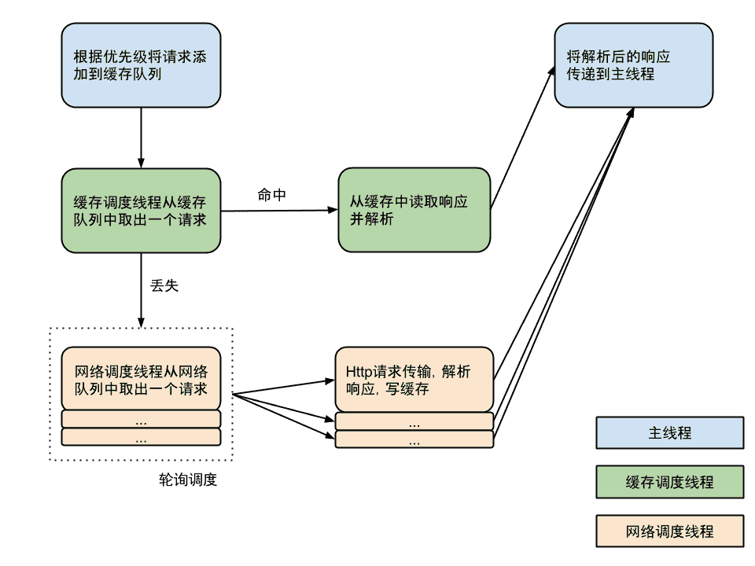

# 网络

### 1 Volley 
* Volley 是 Google 推出的 Android 异步网络请求框架和图片加载框架。在 Google I/O 2013 大会上发布。

* 主页: https://android.googlesource.com/platform/frameworks/volley/

* 应用场景：数据类小(指不能是大文件)，频繁的网络操作。大数据会出现OOM

* 特点: 
	* 通信更快,更简单
	* 支持网络请求的排序,优先级处理
	* 支持网络请求的缓存
	* 多级别的取消请求
	* 扩展性强
	
* 注意事项: 
	* 如果自己编译Volley的话,compileSdkVersion需要<=22,这是因为在Android6.0中Google移除了httpClient相关的API
	* Volley仅适合用于通信频繁数据量小的网络操作
	* 大数据量(指大文件)的网络操作并不适合Volley
	* 生成的jar文件地址:
		* \build\intermediates\bundles\release\classes.jar

	* 生成的aar文件地址:
		* \build\outputs\aar

* 工作原理图

	

* 使用步骤:

		    //1. 创建请求队列
	        RequestQueue requestQueue = Volley.newRequestQueue(this);
	        //2. 创建StringRequest
	        StringRequest stringRequest = new StringRequest("http://www.baidu.com", new StringListener(), new MyErrorListener());
	        //3. 把请求加到队列当中
	        requestQueue.add(stringRequest);

			private class StringListener implements Response.Listener<String> {
		        @Override
		        public void onResponse(String s) {
		             tv.setText(s);
		        }
		    }
		
		    private class MyErrorListener implements Response.ErrorListener {
		        @Override
		        public void onErrorResponse(VolleyError volleyError) {
		            Toast.makeText(MainActivity.this,volleyError.toString(),0).show();
		        }
		    }

### 2 Okhttp
* 主页: https://github.com/square/okhttp

* 特点:
	* 支持HTTP/2 和 SPDY
	* 默认支持 GZIP 降低传输内容的大小
	* 支持网络请求的缓存
	* 当网络出现问题时,自动重试一个主机的多个 IP 地址

* 请求流程：

   
	
* 配置:  compile 'com.squareup.okhttp3:okhttp:3.2.0'

* 使用步骤:

		    //1. 创建OkHttpClient对象
	        OkHttpClient client = new OkHttpClient();

	        //2. 创建Request对象
	        Request request = new Request.Builder()
	                .url("http://www.baidu.com")
	                .build();
	
	        //3. 添加Request对象到OkHttpClient对象中并执行请求
	        //同步操作，高版本会报网络在主线程异常
	        //Response response = client.newCall(request).execute();
	        //异步网络操作
	        client.newCall(request).enqueue(new Callback() {
	            @Override
		            public void onFailure(Call call, IOException e) {
		                showToastInAnyThread("网络错误");
		            }
		            @Override
		            public void onResponse(Call call, Response response) throws IOException {
		                String result = response.body().string();
		                showToastInAnyThread(result);
		            }
		        });
		    }
		    public void showToastInAnyThread(final String text){
		         runOnUiThread(new Runnable() {
		             @Override
		             public void run() {
		                 Toast.makeText(MainActivity.this,text,0).show();
		             }
		         });
		    }
	

* 因为原生OkHttp的使用比较复杂,有一个包装过的工具项目okhttp-utils使用非常简单
	* 添加依赖: compile 'com.zhy:okhttputils:2.3.8'
	* 工具类简介:https://github.com/hongyangAndroid/okhttp-utils
	* 编写步骤：
	
	        OkHttpUtils.get()
	        .url("http://www.baidu.com")
	        .build()
	        .readTimeOut(3000)//设置读取超时时间
	        .execute(new StringCallback() {
	            @Override
	            public void onError(Call call, Exception e) {
	                Toast.makeText(MainActivity.this,e.toString(),0).show();
	            }
	
	            @Override
	            public void onResponse(String s) {
	                Toast.makeText(MainActivity.this,s,0).show();
	            }
	        });

