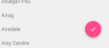
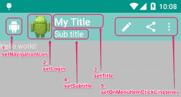
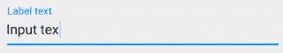
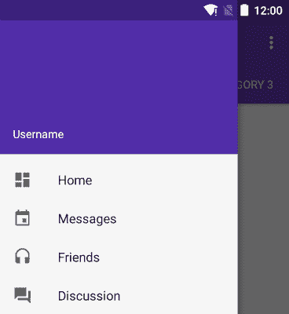
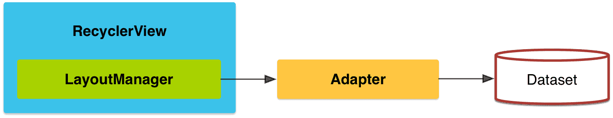

#Android 新特性(5.0/6.0)

*  控件布局

		CoordinatorLayout 		(协调者布局)
		FloatingActionButton 	(悬浮操作按钮)
		Toolbar 工具栏			(替代之前的ActionBar)
		AppBarLayout 			(应用标题栏容器)
		CollapsingToolbarLayout 	折叠效果的布局容器
		CoordinatorLayout Behaviors	(变化反应)的使用
		TabLayout 				标签导航
		TextInputLayout 		输入框控件的悬浮标签
		NavigationView 			抽屉导航
		RecyclerView 			代替ListView/GridView

* 新特性

		系统主题
		高度与阴影
		阴影与轮廓
		轮廓与裁剪
		矢量图
		drawable染色
		取色器
		涟漪动画
		xml涟漪动画
		代码涟漪动画
		状态动画
		矢量图动画
		路径动画
		揭示动画
		Activity转场动画
		共享元素转场动画
		xml配置转场动画
		CardView
		取色器的使用
		如何兼容低版本

* 运行时权限(6.0)

#Material Design
----
### 01 概述
* 安卓5.0是有史以来最重要的安卓版本之一，这其中有很大部分要归功于Material Design的引入，这种新的设计语言让整个安卓的用户体验焕然一新。

* 配置方式:  
在build.gradle的dependencies节点下添加
	
	> compile 'com.android.support:design:23.1.1'  
	> 或  
	> compile 'com.android.support:design:23.4.0'

* AppCompatActivity
	> 界面不再继承 Activity, FragmentActivity 或ActionBarActivity, 而是继承AppCompatActivity, 目的是为了将MD的风格,及Toolbar等新的特效兼容到低版本

* Theme.AppCompat
	> Activity的主题配置为Theme.AppCompat, 在主题中可以配置许多系统自带属性值. 目的同样是为了将新的风格兼容到API 7

### 02 协调者布局 CoordinatorLayout
* 实现了多种Material Design中提到的滚动效果.
把CoordinatorLayout作为根布局容器，其子控件可以不用写动画相关的代码就能产生动画

* MD提供的主要子控件有:

		 FloatingActionButton 浮动操作按钮
		 AppBarLayout		  应用标题栏容器 
		 NestedScrollView 	  类似于ScrollView, 配合AppBarLayout执行动画使用
		 Toolbar 			  工具栏(替代之前的ActionBar)
		 Snackbar 			  反馈提示栏
		 RecyclerView 		  自带回收的ListView

* `android:fitsSystemWindows="true"` 适应系统, 是否把内容显示到状态栏	

		当status bar为透明或半透明时(4.4以上),系统会设置view的paddingTop值为一个适合的值(status bar的高度)让view的内容不被上拉到状态栏，当在不占据status bar的情况下(4.4以下)会设置paddingTop值为0(因为没有占据status bar所以不用留出空间)。

* 示意图如下:  
> 

### 03 悬浮按钮 FloatingActionButton
* 在CoordinatorLayout中使用	

> 

* 常用属性:

		src 				 设置FAB的图标，Google建议符合Design设计的该图标大小为24dp。
		app:backgroundTint   设置FAB的背景颜色。
		app:rippleColor 	 设置FAB点击时的背景颜色。。
		app:elevation 		 默认状态下FAB的阴影大小。
		app:pressedTranslationZ  点击时候FAB的阴影大小。
		app:fabSize 		 设置FAB的大小，该属性有两个值，分别为normal和mini，对应的FAB大小分别为56dp和40dp。

		app:borderWidth 	 FAB边缘宽度, 在有的4.1的sdk上FAB会显示为正方形，或在5.0以后的sdk没有阴影效果。可以设置为borderWidth="0dp"解决此问题

* 把FloatingActionButton设置到某个布局的特定位置

		通过`app:layout_anchor(布局锚) 和 app:layout_anchorGravity属性创造出悬浮效果
	
		app:layout_anchor		: 把指定的`锚点`控件作为当前Button的目标视图。
		app:layout_anchorGravity: 在目标视图中的位置。值由bottom、center、right、left、top等

### 04 工具栏 ToolBar 
> 

* 作用：	
 	* 用来替代以往的ActionBar
	* 是应用的内容的标准工具栏

* 快速入门
	
		1.必须在Activity配置的theme中去除ActionBar 	
	
				如使用Theme.AppCompat.Light.NoActionBar
	
		        <item name="windowActionBar">false</item>
		        <item name="windowNoTitle">true</item>
		2.布局
			<!--属性和代码中都可以设置标题、子标题等-->
		    <android.support.v7.widget.Toolbar
		        android:id="@+id/toolbar"
		        app:title="App Title"
		        app:subtitle="Sub Title"         
		        android:layout_height="wrap_content"
		        android:minHeight="?attr/actionBarSize"
		        android:layout_width="match_parent"
		        android:background="?attr/colorPrimary"/>
	
		3.Java代码	
	        Toolbar toolbar = (Toolbar) findViewById(R.id.toolbar);
	        //设置标题
	        toolbar.setTitle("标题");
	        toolbar.setSubtitle("子标题");
	        toolbar.setLogo(R.mipmap.ic_launcher);
	        
	        //用布局中的toolbar作为actionbar
	        setSupportActionBar(toolbar);
	        //显示返回按钮
	         getSupportActionBar().setDisplayHomeAsUpEnabled(true);

         
### 05 应用标题栏容器 AppBarLayout 

* 概述

		AppBarLayout继承自LinearLayout，布局方向为垂直方向。
		可以让你定制当某个可滚动View（ScrollView）的滚动手势发生变化时，其内部的子View实现何种动作（跟着一起滚动、保持不动等等）

* 布局结构如下:
	
		<CoordinatorLayout>
		    <AppbarLayout>
				<ImageView/>
				<Toolbar/>
			</AppbarLayout>
		    <NestedScrollView/>
		</CoordinatorLayout>

* 常用属性

		1. AppBarLayout只能作为CoordinatorLayout里的第一个子view。
		
		2. NestedScrollView上添加  `app:layout_behavior`
			* 属性值配置为`@string/appbar_scrolling_view_behavior`,
			  该值在com.android.support的design包下,
			  用来通知AppBarLayout, 界面内容发生了滚动事件.
		
		3. 在AppBarLayout中的子View中配置 `app:layout_scrollFlags`
			* 可以在滑动事件发生的时候跟着滚动
			* app:layout_scrollFlags的属性值
				- `scroll` 
					> 跟着滑动方向滑动(只有配置了scroll, 其他属性值才能生效)
					
				- `enterAlways` 
					> 不管滑动列表到哪里, 只要往下拉, 当前控件就跟着往下滑出. 
					
				- `enterAlwaysCollapsed` 
					> 向下滑动，控件展示设置的最小高度
					  要配合`android:minHeight="50dp"`属性使用.
					  最小高度即为折叠后的高度 (配置方式:`"scroll|enterAlways|enterAlwaysCollapsed"`)
					
				- `exitUntilCollapsed` 
					>  向上滑动，折叠到设置的最小高度
						配合`android:minHeight="50dp"`属性使用.
						最小高度即为折叠后的高度(配置方式:`"scroll|exitUntilCollapsed"`)
					
				- `snap` 
					> 滑动结束的时候，如果这个View没有显示完全，
						它就会滑动到这个View的上边或下边

### 06 折叠效果的布局容器 CollapsingToolbarLayout 

* 给Toolbar添加`app:layout_collapseMode`属性可以配置向上滑动时的效果
	
		app:layout_collapseMode="none" 默认效果,随父控件一起滑动
		app:layout_collapseMode="pin"  图钉效果,开始滑动时自己不动, 到顶端才离开
		app:layout_collapseMode="parallax" 视察效果,随父控件进行高度缩放

* 布局结构如下:
	
		<CoordinatorLayout>
		    <AppbarLayout>
				<CollapsingToolbarLayout>
					<ImageView/>
					<Toolbar/>
				</CollapsingToolbarLayout>
				...
			</AppbarLayout>
		    <NestedScrollView/>
		</CoordinatorLayout>

### 07 标签导航 TabLayout 
* Tab 是在 Android 应用程序中用户体验(UX)最佳实践的一部分

* 布局配置

        <android.support.design.widget.TabLayout
            android:id="@+id/tabs"
            android:layout_width="match_parent"
            android:layout_height="wrap_content" />

* 代码配置:

        TabLayout tabLayout = (TabLayout) findViewById(R.id.tabs);
		// 关联ViewPager
        tabLayout.setupWithViewPager(mViewPager);

> 

### 08 输入框控件的悬浮标签 TextInputLayout 
* 使用场景: 用来显示一个提示或一个错误信息, 默认会把Hint放置在上方
* 使用方式: 用 TextInputLayout 包裹 EditText 即可, 如下

		<android.support.design.widget.TextInputLayout
		    android:layout_width="match_parent"
		    android:layout_height="wrap_content">
		    <EditText
		        android:layout_width="match_parent"
		        android:layout_height="wrap_content"
		        android:hint="Username" />
		</android.support.design.widget.TextInputLayout>

> 

### 09 抽屉导航 NavigationView
* NavigationView是android-support-design包下的一个控件, 用来配合`android.support.v4.widget.DrawerLayout`便捷地配置抽屉菜单

		<android.support.v4.widget.DrawerLayout
		    xmlns:app="http://schemas.android.com/apk/res-auto">
		    <include layout="@layout/activity_main"/>

		    <android.support.design.widget.NavigationView>
		    ...
		    </android.support.design.widget.NavigationView>

		</android.support.v4.widget.DrawerLayout>

* 重要的属性值

	
        android:layout_gravity="start" end 	  抽屉在左侧滑出
        android:fitsSystemWindows="true"  	  适配系统窗体
        app:headerLayout="@layout/nav_header_main_navi" 设置头布局文件
        app:menu="@menu/activity_main_navi_drawer"		设置下边菜单文件

* 给导航条目添加监听:
		
		navigationView.setNavigationItemSelectedListener(
			new OnNavigationItemSelectedListener(){...}
		)

> 

# RecyclerView
------
* RecyclerView 是Android L (5.0)版本中新添加的一个用来取代ListView/GridView的SDK，它的灵活性与可替代性比listview更好。

* 核心类

	- Adapter：使用RecyclerView之前，你需要一个继承自RecyclerView.Adapter的适配器，作用是将数据与每一个item的界面进行绑定。

	- LayoutManager：用来确定每一个item如何进行排列摆放，何时展示和隐藏。目前SDK中提供了三种自带的LayoutManager:

			LinearLayoutManager	：线性布局管理器
			GridLayoutManager	：九宫格布局管理器
			StaggeredGridLayoutManager

* 引用库会自动添加到工程, 如果sdk版本较低,没有自动添加,可在build.gradle中手动添加

			compile 'com.android.support:recyclerview-v7:21.0.+'

> 

# Android6.0运行时权限
----
* 通过注解的方式巧妙的减少了在成功请求权限之后的操作，减少的步奏是完成获取权限成功之后自动调用被注解的方法

* 核心方法 (需`Android 6.0 (API level 23)`及以上)
	- 检查是否已获得权限
		> `context.checkPermission(permission, android.os.Process.myPid(), Process.myUid())`
	- 检查是否需要弹出本地提示			
		> `activity.shouldShowRequestPermissionRational	e(permission);`  
		> `fragment.shouldShowRequestPermissionRationale(perm);`  
	- 请求指定权限
		> `activity.requestPermissions(permissions, requestCode);`  
		> `fragment.requestPermissions(perms, requestCode);`

* 快速入门

		1. 引用库
			dependencies {
			  compile 'pub.devrel:easypermissions:0.1.9'
			}

		 2. 检查权限
			String[] perms = {Manifest.permission.CAMERA, Manifest.permission.CHANGE_WIFI_STATE};
			if (EasyPermissions.hasPermissions(this, perms)) {
			   //...     
			} else {
			    //...
			}

		3. 申请权限
			EasyPermissions.requestPermissions(this, "拍照需要摄像头权限",
                    RC_CAMERA_AND_WIFI, perms);

		4. 实现EasyPermissions.PermissionCallbacks接口，直接处理权限是否成功申请
	   		 @Override
		    public void onRequestPermissionsResult(int requestCode, String[] permissions, int[] grantResults) {
		        super.onRequestPermissionsResult(requestCode, permissions, grantResults);
		
		        // Forward results to EasyPermissions
		        EasyPermissions.onRequestPermissionsResult(requestCode, permissions, grantResults, this);
		    }
		
		    //成功
		    @Override
		    public void onPermissionsGranted(int requestCode, List<String> list) {
		        // Some permissions have been granted
		        // ...
		    }
		
		    //失败
		    @Override
		    public void onPermissionsDenied(int requestCode, List<String> list) {
		        // Some permissions have been denied
		        // ...
		    }

* 权限申请官方文档
	> https://developer.android.com/training/permissions/index.html  

* 开源项目
	> https://github.com/googlesamples/easypermissions  
	  https://github.com/Karumi/Dexter  
	  https://github.com/hotchemi/PermissionsDispatcher