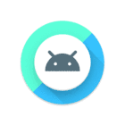
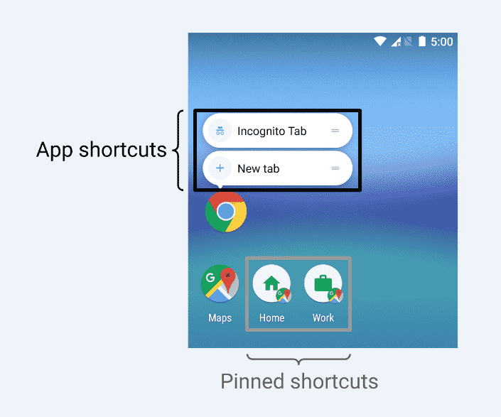
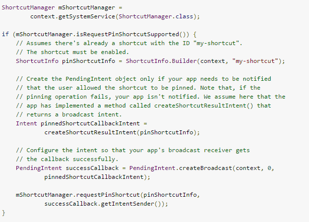
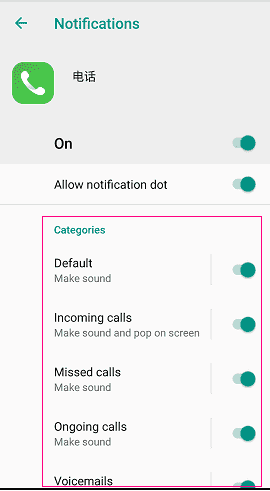
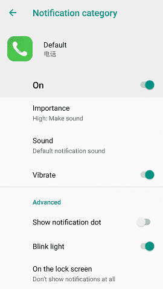

## 1.TensorFlow Lite
- TensorFlow Lite是谷歌机器学习工具TensorFlow的精简版，新工具可帮助低功耗设备跟上当今高强度任务处理，利用新的神经网络API帮助底层芯片加速数据处理。这一功能有助于为下一代在线设备提高语音处理，视觉搜索，增强现实等能力。随着移动设备制造商越来越多地在其ROM中加入各种AI功能，对应的，像高通这样的芯片制造商已经开始为其产品增加片上机器学习功能，因此TensorFlow Lite来得正是时候。

- TensorFlow Lite可以解读为谷歌将人工智能应用在应用程序中的尝试，并进一步将机器学习的优势扩展到Android生态系统。

## 2.画中画模式 — PIP
1. Android O中，谷歌更加强调多任务处理场景中的流畅性，在I/O2017上，谷歌演示了增强功能的画中画模式，为用户带来不同应用程序间的流畅操作体验。例如用户可以在Netflix上观看电影，支持将电影屏幕缩小成悬浮窗口，在看电影的同时进行查看日历、搜索信息等其他工作，这和普通的画中画分屏模式并不相同。这一功能的唤醒只需要点击Home键按钮，如果想结束这一模式，可以将小窗口滑下来以终止。

2. PIP 是一种多窗口显示模式，多用于视频播放，即你可以一边发微信一边看视频.
3. 关于生命周期:
 - PIP 模式不会改变 Activity的生命周期。在指定时间只有最近与用户交互过的Activity为活动状态,该 Activity将被视为顶级Activity。所有其他Activity虽然可见,但均处于暂停状态。当一个 Activity 处于 PIP 模式时，其实它是出在暂停状态，但其内容会继续展示。

4. API变更:
  - 在 Android O 中新增 PictureInPictureArgs 对象来指明你的 Activity 在 PIP 模式中的属性,比如长宽比等。
  - Android O 还新增了以下方法来支持 PIP。
    <pre>
    
    android:supportsPictureInPicture=ture//清单文件Activity中加入
    Activity.enterPictureInPictureMode(PictureInPictureArgs args);//将Activity置于 PIP 模式之下
    Activity.setPictureInPictureArgs()：用于更新 Activity 在 PIP 模式下的设置。如果 Activity 正处于 PIP 模式之下，那么更改的属性将立即生效。
    Activity.isInPictureInPictureMode();
    @Override
    public void onPictureInPictureModeChanged(boolean isInPictureInPictureMode) {
        super.onPictureInPictureModeChanged(isInPictureInPictureMode);
    }
    
    </pre>

## 3.自适应图标由两张图层和一个形状来定义 — Adaptive Icons
1. 在以前的 Android 版本中，图标大小定义为 48 x 48 dp。现在你必须按照以下的规范定义你的图层大小：
  - 两张图层大小都必须为 108 x 108 dp。
  - 图层中心 72 x 72 dp 范围为可视范围。
    <pre>
    
    < application>
        android:icon="@mipmap/ic_launcher"
        android:roundIcon="@mipmap/ic_launcher_round"
    < /application>

    //res/mipmap-anydpi/ic_launcher.xml
    < maskable-icon>
        < background android:drawable="@color/ic_background"/><!--背景-->
        < foreground android:drawable="@mipmap/ic_foreground"/><!--前景-->
    < /maskable-icon>
    </img>
    </pre>
  - 系统会保留四周外的 36dp 范围用于生成有趣的视觉效果(如视差和跳动) [图片来源](https://blog.csdn.net/wangwangli6/article/details/70211002)
	<table>
	 <tr>
	  <td>

</td>
	  <td>

</td>
	 </tr>
	 <tr>
	  <td>
1.自适应
</td>
	  <td>
2.视差效果
</td>
	 </tr>
	 <tr>
	  <td>

</td>
	 </tr>
	 <tr>
	  <td>
3.视差效果
</td>
	 </tr>
	</table>

## 4.固定快捷方式和小部件 — Pinning shortcuts
- Pinning shortcuts 是一个比 APP shortcuts 更小的快捷方式，放置于桌面上，用于更快速的打开某一 APP 的某单一任务。Pinning shortcuts 在桌面上可呈现不同的图标显示。
    

- 开发指南
  1. 首先使用 isRequestPinShortcutSupported() 方法校验手机是否支持启动这种快捷方式。
  2. 创建 ShortcutInfo 对象。
  3. 用 requestPinShortcut() 方法应用 Pinning shortcuts。你可以通过 PendingIntent 来通知你的 shortcuts 有没有创建成功。
    

## 5.通知渠道
- Notification channels 实际就是通知分类，每个应用可以创建多个不同的分类来显示通知，可以为不同的类别定制如下内容,详见[链接](https://blog.csdn.net/myfriend0/article/details/78461857/)
  1. Importance（重要性） 
  2. Sound（声音） 
  3. Lights（提示灯） 
  4. Vibration（震动） 
  5. Show on lockscreen（锁屏显示） 
  6. Override do not disturb（覆盖勿扰模式）
    <table>
     <tr>
      <td>

</td>
      <td>

</td>
     </tr>
    </table>
