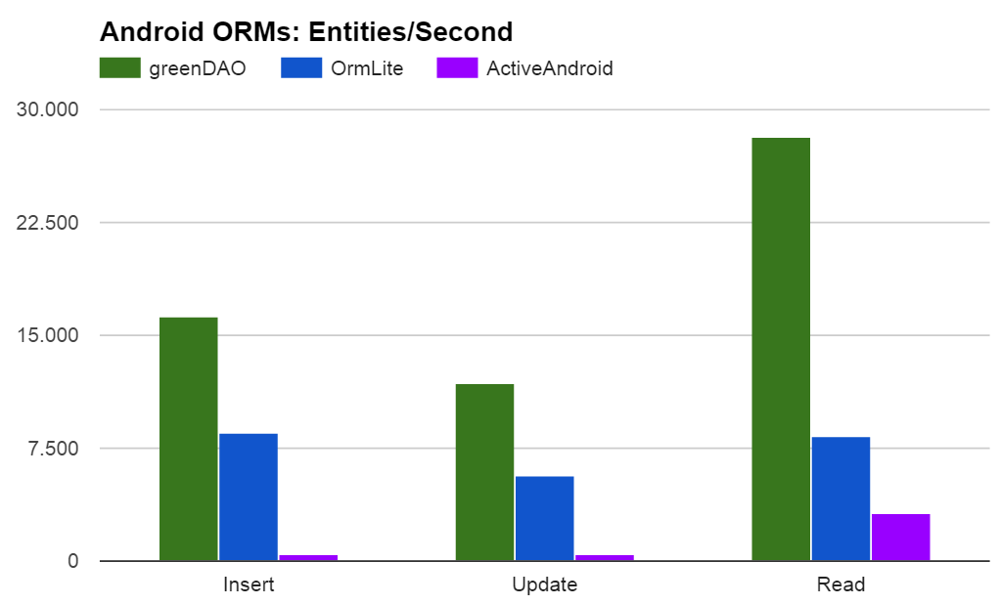

# 数据库

### 1 ormlite		
* 主页: http://ormlite.com/

* 配置: 添加以下依赖
	* compile 'com.j256.ormlite:ormlite-android:4.48'
	* compile 'com.j256.ormlite:ormlite-core:4.48'

* 用途: 操作数据库
* 使用步骤
	1. 创建数据库表结构的实体类.示例代码:
			
			指定数据库表名
			@DatabaseTable(tableName = "user")
			public class User {

				创建主键
			    @DatabaseField(generatedId = true)
			    private int id;

				创建数据库的列
			    @DatabaseField(columnName = "name")
			    private String name;
			    @DatabaseField(columnName = "age")
			    private int age;
			    @DatabaseField(columnName = "tel")
			    private String tel;
				
				//java.lang.IllegalArgumentException: Can't find a no-arg constructor for class cn.itcast.ormlite.User
			    public User() {}

			    public User(String name, int age, String tel) {
			        this.name = name;
			        this.age = age;
			        this.tel = tel;
			    }
			}

	2. 创建OrmLiteSqliteOpenHelper的实现类.示例代码:

			public class UserDBOpenHelper extends OrmLiteSqliteOpenHelper {
				/**
			     * 构造方法
			     * @param context
			     *         上下文
			     * @param databaseName
			     *         数据库的名称
			     * @param factory
			     *         游标工厂
			     * @param databaseVersion
			     *         数据库版本
			     */
			    public OrmlitOpenHelper(Context context) {
			        super(context, "user.db", null,1);
			    }
			    /**
			     * 创建数据库的表
			     */
			    @Override
			    public void onCreate(SQLiteDatabase sqLiteDatabase, ConnectionSource connectionSource) {
			        try {
			            TableUtils.createTable(connectionSource,User.class);
			        } catch (SQLException e) {
			            e.printStackTrace();
			        }
			    }
			    /**
			     * 数据库升级调用
			     */
			    @Override
			    public void onUpgrade(SQLiteDatabase sqLiteDatabase, ConnectionSource connectionSource, int i, int i1) {
			        try {
			            TableUtils.dropTable(connectionSource,User.class,true);
			            onCreate(sqLiteDatabase,connectionSource);
			        } catch (SQLException e) {
			            e.printStackTrace();
			        }
			    }
			}

	3. 获取数据库的DAO对象, 即可进行增删改查的操作.示例代码:

			UserDBOpenHelper helper = new UserDBOpenHelper(this);
			Dao<User, Integer> dao =  helper.getUserDao();

			User user = new User("zhangsan", 12, "13212345678");
			// 增
			dao.create(user);

			// 改
			dao.updateRaw("update user set tel = '18882348888' where name = ?", new String[]{"zhangsan"});

			// 查
		    List<User> list = dao.queryForAll();
            for(User user:list){
                System.out.println(user.toString());
            }

			// 删
			dao.deleteById(1);

### 2 greenDAO 	

* 主页: https://github.com/greenrobot/greenDAO

* 配置: 添加以下依赖
	* compile 'de.greenrobot:greendao:2.1.0'
	* compile 'de.greenrobot:greendao-generator:2.1.0'

* 优点: 	
	* 性能最大化,内存开销最小化
	* 易于使用的API
	* 为Android进行高度优化

* 重要类
	
		DaoMaster：它保存了sqlitedatebase对象以及操作DAO classes（注意：不是对象）。其提供了一些创建和删除table的静态方法，其内部类OpenHelper和DevOpenHelper实现了SQLiteOpenHelper并创建数据库的框架。

		DaoSession：会话层。操作具体的DAO对象（注意：是对象），比如各种getter方法。
		
		XXXDao：实际生成的某某DAO类，通常对应具体的java类，比如NoteDao等。其有更多的权限和方法来操作数据库元素。
		
		XXXEntity：持久的实体对象。通常代表了一个数据库row的标准java properties。

* 使用步骤
	1. 创建自定义的DAOGenerater,指定数据库相关配置并生成相关类

			public class CustomDAOGenerater {
			    public static void main(String[] args) throws Exception {
			        //第一个参数表示数据库版本号,
			        // 如果发生变更会导致数据库更新的操作被调用(如果不修改生成的DaoMaster中的方法
			        // 升级默认操作是删除所有表并重新建表)
			        //第二个参数是生成的DAO类的包路径
			        Schema schema = new Schema(1, "cn.itcast.greemdao.bean");
			
			        // 创建表,参数为表名
			        Entity entity = schema.addEntity("Info");
			        // 为表添加字段
			        entity.addIdProperty().primaryKey().autoincrement(); //自增长id为主键
			        entity.addStringProperty("name").notNull();//非null字段
			        entity.addIntProperty("age");//Int类型字段
			        entity.addStringProperty("tel");// String类型字段
			
			        // 生成数据库相关类
			        //第二个参数指定生成文件的本次存储路径,AndroidStudio工程指定到当前工程的java路径
			        new DaoGenerator().generateAll(schema,
						 "D:\\Android\\code-as\\open-source\\database\\greemdao\\src\\main\\java");   
			    }
			}

	2. 在Application中通过DaoMaster.DevOpenHelper初始化数据库

		    // 该初始化过程最好放在Application中进行,避免创建多个Session
		    private void setupDatabase() {
		        // 通过 DaoMaster 的内部类 DevOpenHelper创建数据库
		        // 注意：默认的 DaoMaster.DevOpenHelper 会在数据库升级时，删除所有的表		       
		        /**
		         * @param context :　Context
		         * @param name : 数据库名字
		         * @param factory : CursorFactroy
		         */
		        DaoMaster.DevOpenHelper helper = new DaoMaster.DevOpenHelper(this, "student.db", null);
		        // 获取数据库
		        SQLiteDatabase database = helper.getWritableDatabase();
		        // 获取DaoMaster
		        DaoMaster daoMaster = new DaoMaster(database);
		        // 获取Session
		        DaoSession daoSession = daoMaster.newSession();
		        // 获取对应的表的DAO对象
		        InfoDao dao = daoSession.getInfoDao();
		    }

	3. 获取数据库的DAO对象,即可进行增删改查的操作
	
			// 增
			dao.insert(new Info(2l,"张三",18,"119"));
			// 删
			dao.deleteByKey(1L);
			// 改
			dao.update(new Info(3L, "赵琦", 78, "18812348888"));

			// 查
			QueryBuilder<Info> builder = dao.queryBuilder();
	        List<Info> build = builder.list();
	        for(Info info:build){
	            Log.e("MainActivity",info.toString());
	        }

### 3 Litepal

* 主页: https://github.com/LitePalFramework/LitePal

* 中文文档地址: http://blog.csdn.net/sinyu890807/article/category/2522725

* 

